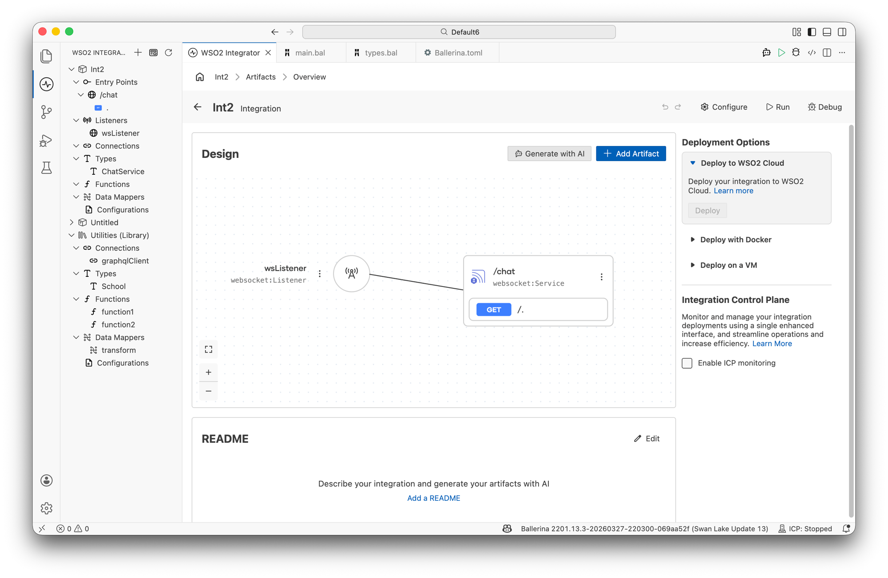
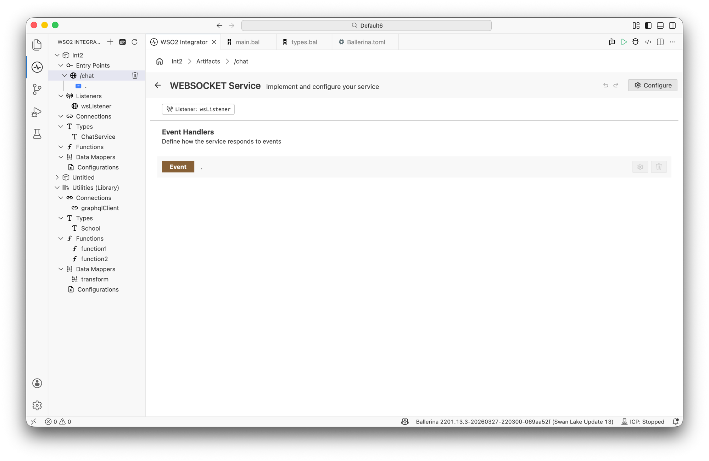
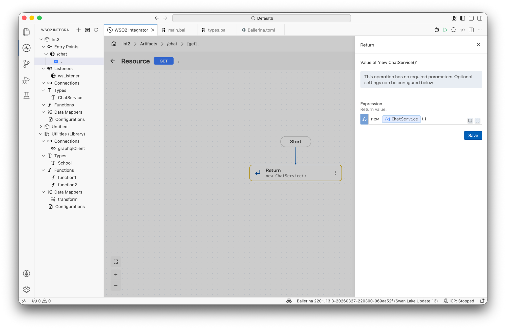
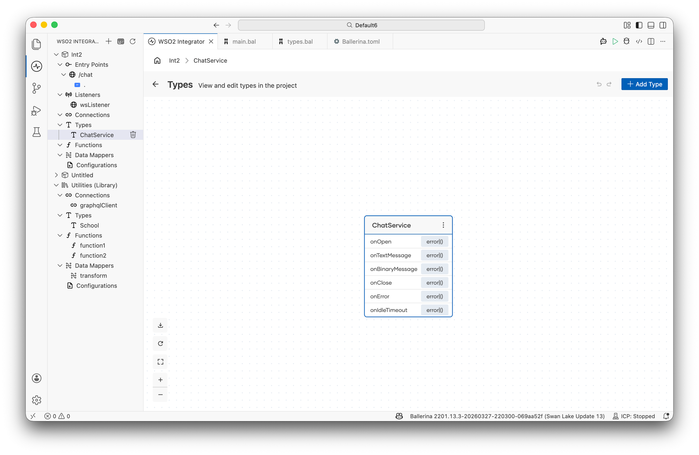
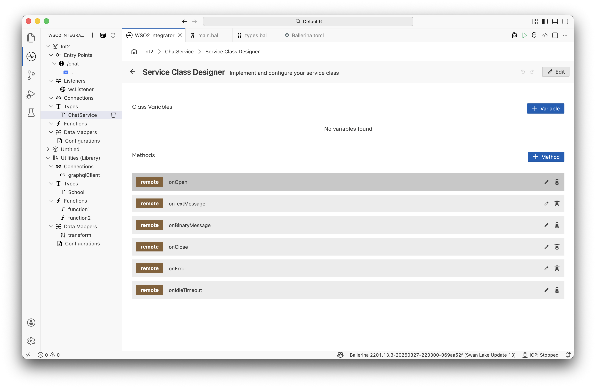

# WebSocket Service

WebSocket services enable persistent, full-duplex communication between clients and the server. Use them for real-time features such as live dashboards, chat applications, collaborative tools, and push notifications.

:::note
Creating a WebSocket service requires Ballerina code. Once the service exists, you can use the visual designer to implement logic for individual connection handlers.
:::

## Creating a WebSocket service

A WebSocket service consists of two parts: an **upgrade resource** that handles the initial HTTP-to-WebSocket handshake, and a **connection service class** that implements the per-connection lifecycle callbacks.

```ballerina
import ballerina/websocket;

configurable int port = 8080;

listener websocket:Listener wsListener = new (port);

service /chat on wsListener {

    resource function get .() returns websocket:Service|error {
        return new ChatService();
    }
}

service class ChatService {
    *websocket:Service;

    remote function onOpen(websocket:Caller caller) returns error? {
        // Handle new connection
    }

    remote function onTextMessage(websocket:Caller caller, string message) returns error? {
        // Handle incoming text message
    }

    remote function onBinaryMessage(websocket:Caller caller, byte[] data) returns error? {
        // Handle incoming binary message
    }

    remote function onClose(websocket:Caller caller, int statusCode, string reason) returns error? {
        // Handle connection close
    }

    remote function onError(websocket:Caller caller, error err) returns error? {
        // Handle connection error
    }

    remote function onIdleTimeout(websocket:Caller caller) returns error? {
        // Handle idle timeout
    }
}
```

The `get` resource at the base path handles the WebSocket upgrade. It returns the connection service instance (`new ChatService()`) that the runtime uses to dispatch all subsequent messages for that connection.

## Designing logic with the visual designer

Although WebSocket service creation is not supported in the visual designer, you can use it to implement logic for connection handlers defined in code. Once the service exists in the project, it appears in the **Entry Points** sidebar and on the design canvas.



Click the service node (or the service name in the sidebar) to open the **WebSocket Service** designer, which lists the upgrade resource handler and the attached listener.



:::note
Not all WebSocket service configuration options are available through the visual designer. For full control — including listener configuration and idle timeout settings — use Ballerina code directly.
:::

## Implementing connection handlers

The `onTextMessage`, `onBinaryMessage`, `onClose`, `onError`, and `onIdleTimeout` handlers are implemented inside the connection service class (for example, `ChatService`) rather than in the main WebSocket service. Access the service class through the **Types** panel in the sidebar.

**Finding the connection service class**

In the upgrade resource flow designer, click the **Return** step. The right panel shows the return expression, including the connection service class being instantiated (for example, `new ChatService()`).



**Opening the type diagram**

In the sidebar, expand **Types** and click the connection service class name (for example, `ChatService`). This opens the **Types** view, which shows the type diagram for that class with its methods listed.



**Opening the Service Class Designer**

Click the Service Class type node in the diagram to open the **Service Class Designer**. This view shows:

- **Class Variables** — shared state available across all handler methods; use **+ Variable** to add one.
- **Methods** — the remote functions generated for the connection service.



Click any method row (for example, `onTextMessage`) to open the **flow designer view** for that handler, where you can define the logic for processing messages, handling errors, or cleaning up on close.

## Connection lifecycle callbacks

| Callback | Trigger | Typical use |
|---|---|---|
| `onOpen` | Connection upgrade successful | Initialize session state, send welcome message |
| `onTextMessage` | Text frame received | Parse and process message, write a response with `caller->writeTextMessage()` |
| `onBinaryMessage` | Binary frame received | Handle binary payloads such as files or media |
| `onClose` | Connection closed | Remove client from broadcast list, release resources |
| `onError` | Connection error | Log and handle error conditions |
| `onIdleTimeout` | Idle timeout reached | Close or keep-alive the connection |

## Common patterns

### Echo server

```ballerina
service class EchoService {
    *websocket:Service;

    remote function onTextMessage(websocket:Caller caller, string message) returns error? {
        check caller->writeTextMessage("Echo: " + message);
    }
}
```

### Broadcast to all connected clients

```ballerina
isolated map<websocket:Caller> connections = {};

service class BroadcastService {
    *websocket:Service;

    remote function onOpen(websocket:Caller caller) returns error? {
        lock {
            connections[caller.getConnectionId()] = caller;
        }
    }

    remote function onTextMessage(websocket:Caller caller, string message) returns error? {
        lock {
            foreach websocket:Caller conn in connections {
                check conn->writeTextMessage(message);
            }
        }
    }

    remote function onClose(websocket:Caller caller, int statusCode, string reason) returns error? {
        lock {
            _ = connections.remove(caller.getConnectionId());
        }
    }
}
```

## For more details

See the [Ballerina WebSocket specification](https://ballerina.io/spec/websocket/) for the complete language-level reference, including TLS configuration, authentication, compression, and custom message dispatching.
