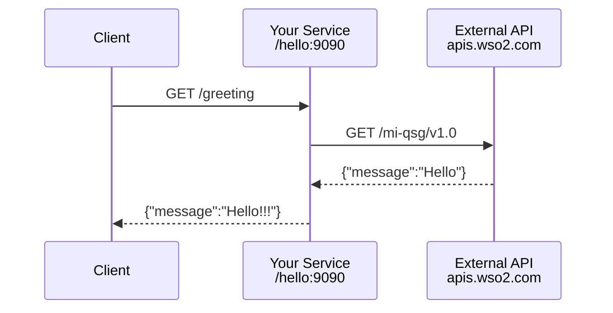

import ThemedImage from '@theme/ThemedImage';
import useBaseUrl from '@docusaurus/useBaseUrl';

# Build an API Integration

**Time:** Under 10 minutes | **What you'll build:** An HTTP service that receives requests, calls an external API, and returns the response.

## Prerequisites

- [WSO2 Integrator extension installed](install.md)

## Architecture

## Step 1: Create the project

1. Open WSO2 Integrator.
2. Select **Create**.
3. Set **Integration Name** to `HelloWorldAPI`.
4. Set **Project Name** to `QuickStart`.
5. Select **Browse**.
6. Select the project location and select **Open**.
7. Select **Create Integration**.

<ThemedImage
    alt="Create the project"
    sources={{
        light: useBaseUrl('/img/get-started/build-api-integration/create-the-project-light.gif'),
        dark: useBaseUrl('/img/get-started/build-api-integration/create-the-project-dark.gif'),
    }}
/>

## Step 2: Add an HTTP service

1. Select **HelloWorldAPI**.
2. In the design view, select **Add Artifact**.
3. Select **HTTP Service** under **Integration as API**.
4. Keep **Service contract** as **Design from scratch**.
5. Set **Service base path** to `/hello`.
6. Select **Create**.

<ThemedImage
    alt="Add an HTTP service"
    sources={{
        light: useBaseUrl('/img/get-started/build-api-integration/add-an-http-service-light.gif'),
        dark: useBaseUrl('/img/get-started/build-api-integration/add-an-http-service-dark.gif'),
    }}
/>

## Step 3: Design the integration flow

1. In the HTTP service design view, select **+ Add Resouses** resource.
2. Select **GET**.
2. Set the **resource path** to `greeting`.
3. Select **Save**.
4. Select **+** inside the resource flow.
5. Select **Add Connection**.
6. Select **HTTP**.
1. Set the **Url** to `https://apis.wso2.com/zvdz/mi-qsg/v1.0`.
2. Set the **Connection Name** to `externalApi` and select **Save Connection**.
3. Select **externalApi**.

<ThemedImage
    alt="Design the integration flow"
    sources={{
        light: useBaseUrl('/img/get-started/build-api-integration/design-the-integration-flow-light.gif'),
        dark: useBaseUrl('/img/get-started/build-api-integration/design-the-integration-flow-dark.gif'),
    }}
/>

## Step 4: Configure HTTP

1. Select **Get**.
2. Set **Path** to `/`.
3. Set **Result** to `response`.
4. Set **Target Type** to `json`.
5. Select **Target Type**.
5. Select **Save**.

<ThemedImage
    alt="Configure HTTP"
    sources={{
        light: useBaseUrl('/img/get-started/build-api-integration/configure-http-light.gif'),
        dark: useBaseUrl('/img/get-started/build-api-integration/configure-http-dark.gif'),
    }}
/>

## Step 5: Return the response

1. Select **+** inside the resource flow.
2. Select **Return** node.
3. Set **Expression** to `response`.
4. Select **Save**.

<ThemedImage
    alt="Return the response"
    sources={{
        light: useBaseUrl('/img/get-started/build-api-integration/return-the-response-light.gif'),
        dark: useBaseUrl('/img/get-started/build-api-integration/return-the-response-dark.gif'),
    }}
/>

## Step 6: Run and test

1. Select **Run**.
2. Select **Try it**.
2. Select **Execute Cell**.
4. The project executes immediately and give 200 response "Hello World".

<ThemedImage
    alt="Run and test"
    sources={{
        light: useBaseUrl('/img/get-started/build-api-integration/run-and-test-light.gif'),
        dark: useBaseUrl('/img/get-started/build-api-integration/run-and-test-dark.gif'),
    }}
/>

## What's next

- [Automation](build-automation.md) -- Build a scheduled job
- [AI agent](build-ai-agent.md) -- Build an intelligent agent
- [Event-driven integration](build-event-driven-integration.md) -- React to messages from brokers
- [File-driven integration](build-file-driven-integration.md) -- Process files from FTP or local directories
- [Tutorials](/docs/tutorials/rest-api-aggregation) -- End-to-end walkthroughs and patterns
