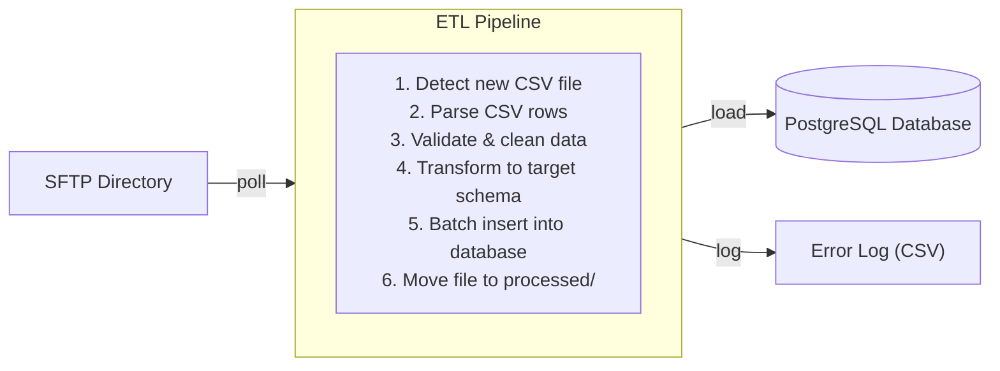

# File Batch ETL Pipeline

## What you'll build

A file-based ETL (Extract, Transform, Load) pipeline that watches an SFTP directory for incoming CSV files, parses and transforms the records, validates data quality, and loads the results into a PostgreSQL database.



## What you'll learn

- Watching an SFTP directory for new files using the file processor trigger
- Parsing CSV data with Ballerina's `ballerina/data.csv` module
- Applying row-level data validation and transformation
- Batch-loading records into a relational database
- Handling bad rows and generating an error report

## Prerequisites

- WSO2 Integrator VS Code extension installed
- SFTP server (or local directory for testing)
- PostgreSQL database

**Time estimate:** 30--45 minutes

## Step-by-Step walkthrough

### Step 1: Create the project

1. Open VS Code and run **WSO2 Integrator: Create New Project**.
2. Name the project `file-batch-etl`.
3. Configure `Config.toml`:

```toml
[etl]
batchSize = 500

[etl.sftp]
host = "sftp.example.com"
port = 22
username = "etl-user"
privateKeyPath = "/path/to/key"
watchDir = "/incoming/sales"
processedDir = "/processed/sales"
errorDir = "/errors/sales"

[etl.db]
host = "localhost"
port = 5432
database = "warehouse"
user = "etl_writer"
password = "secret"
```

### Step 2: Define the data types

Create `types.bal` with source and target record types:

```ballerina
// types.bal

// Raw row from the incoming CSV file.
type SalesCsvRow record {|
    string transaction_id;
    string date;
    string product_code;
    string product_name;
    string quantity;
    string unit_price;
    string customer_email;
    string region;
|};

// Validated and transformed record ready for database insertion.
type SalesRecord record {|
    string transactionId;
    time:Civil transactionDate;
    string productCode;
    string productName;
    int quantity;
    decimal unitPrice;
    decimal totalAmount;
    string customerEmail;
    string region;
|};

// A row that failed validation.
type RejectedRow record {|
    int lineNumber;
    string rawData;
    string reason;
|};

// Summary of an ETL run.
type EtlRunSummary record {|
    string fileName;
    int totalRows;
    int loadedRows;
    int rejectedRows;
    string startedAt;
    string completedAt;
|};
```

### Step 3: Build the CSV parser and validator

Create `transform.bal`:

```ballerina
// transform.bal
import ballerina/data.csv;
import ballerina/time;
import ballerina/regex;

// Parse a CSV byte stream into raw row records.
function parseCsvFile(byte[] content) returns SalesCsvRow[]|error {
    SalesCsvRow[] rows = check csv:parseBytes(content);
    return rows;
}

// Validate and transform a single raw CSV row.
function transformRow(SalesCsvRow raw, int lineNumber) returns SalesRecord|RejectedRow {
    // Validate required fields.
    if raw.transaction_id.trim() == "" || raw.product_code.trim() == "" {
        return {lineNumber, rawData: raw.toString(), reason: "Missing required field: transaction_id or product_code"};
    }

    // Validate and parse quantity.
    int|error qty = int:fromString(raw.quantity.trim());
    if qty is error || (qty is int && qty <= 0) {
        return {lineNumber, rawData: raw.toString(), reason: "Invalid quantity: " + raw.quantity};
    }

    // Validate and parse unit price.
    decimal|error price = decimal:fromString(raw.unit_price.trim());
    if price is error || (price is decimal && price < 0d) {
        return {lineNumber, rawData: raw.toString(), reason: "Invalid unit_price: " + raw.unit_price};
    }

    // Validate email format.
    if !regex:matches(raw.customer_email.trim(), "^[\\w.-]+@[\\w.-]+\\.\\w+$") {
        return {lineNumber, rawData: raw.toString(), reason: "Invalid email: " + raw.customer_email};
    }

    // Parse the date.
    time:Civil|error txDate = time:civilFromString(raw.date.trim());
    if txDate is error {
        return {lineNumber, rawData: raw.toString(), reason: "Invalid date format: " + raw.date};
    }

    int validQty = check int:fromString(raw.quantity.trim());
    decimal validPrice = check decimal:fromString(raw.unit_price.trim());

    return {
        transactionId: raw.transaction_id.trim(),
        transactionDate: <time:Civil>txDate,
        productCode: raw.product_code.trim(),
        productName: raw.product_name.trim(),
        quantity: validQty,
        unitPrice: validPrice,
        totalAmount: validPrice * <decimal>validQty,
        customerEmail: raw.customer_email.trim().toLowerAscii(),
        region: raw.region.trim()
    };
}
```

### Step 4: Build the database loader

Create `loader.bal` for batch database inserts:

```ballerina
// loader.bal
import ballerinax/postgresql;
import ballerina/log;

configurable int batchSize = 500;
configurable string dbHost = ?;
configurable int dbPort = ?;
configurable string dbName = ?;
configurable string dbUser = ?;
configurable string dbPassword = ?;

final postgresql:Client warehouseDb = check new (dbHost, dbUser, dbPassword, dbName, dbPort);

// Batch-load validated sales records into the database.
function loadRecords(SalesRecord[] records) returns int|error {
    int totalLoaded = 0;

    // Process in batches to avoid overwhelming the database.
    int i = 0;
    while i < records.length() {
        int end = int:min(i + batchSize, records.length());
        SalesRecord[] batch = records.slice(i, end);

        postgresql:ParameterizedQuery[] insertQueries = from SalesRecord rec in batch
            select `INSERT INTO sales (
                transaction_id, transaction_date, product_code, product_name,
                quantity, unit_price, total_amount, customer_email, region
            ) VALUES (
                ${rec.transactionId}, ${rec.transactionDate.toString()},
                ${rec.productCode}, ${rec.productName}, ${rec.quantity},
                ${rec.unitPrice}, ${rec.totalAmount}, ${rec.customerEmail}, ${rec.region}
            ) ON CONFLICT (transaction_id) DO NOTHING`;

        postgresql:ExecutionResult[] results = check warehouseDb->batchExecute(insertQueries);
        totalLoaded += results.length();
        log:printInfo(string `Loaded batch ${i / batchSize + 1}: ${batch.length()} records`);
        i = end;
    }

    return totalLoaded;
}
```

### Step 5: Wire up the file processor

Create `main.bal` with the file processor trigger:

```ballerina
// main.bal
import ballerina/ftp;
import ballerina/log;
import ballerina/io;
import ballerina/time;

configurable string sftpHost = ?;
configurable int sftpPort = ?;
configurable string sftpUsername = ?;
configurable string sftpKeyPath = ?;
configurable string watchDir = ?;
configurable string processedDir = ?;
configurable string errorDir = ?;

// SFTP listener that polls for new files every 60 seconds.
listener ftp:Listener sftpListener = check new ({
    host: sftpHost,
    port: sftpPort,
    auth: {credentials: {username: sftpUsername}, privateKey: {path: sftpKeyPath}},
    path: watchDir,
    pollingInterval: 60
});

service on sftpListener {

    // Triggered when a new file is detected in the watch directory.
    remote function onFileChange(ftp:WatchEvent event) returns error? {
        foreach ftp:FileInfo file in event.addedFiles {
            if !file.name.endsWith(".csv") {
                continue;
            }
            log:printInfo(string `Processing file: ${file.name}`);
            string startTime = time:utcToString(time:utcNow());

            // Step 1: Download the file.
            ftp:Client sftpClient = check new ({
                host: sftpHost, port: sftpPort,
                auth: {credentials: {username: sftpUsername}, privateKey: {path: sftpKeyPath}}
            });
            byte[] content = check sftpClient->get(file.pathDecoded);

            // Step 2: Parse CSV.
            SalesCsvRow[] rawRows = check parseCsvFile(content);
            log:printInfo(string `Parsed ${rawRows.length()} rows from ${file.name}`);

            // Step 3: Validate and transform.
            SalesRecord[] validRecords = [];
            RejectedRow[] rejectedRows = [];
            int lineNum = 1;
            foreach SalesCsvRow raw in rawRows {
                lineNum += 1;
                SalesRecord|RejectedRow result = transformRow(raw, lineNum);
                if result is SalesRecord {
                    validRecords.push(result);
                } else {
                    rejectedRows.push(result);
                }
            }

            // Step 4: Load valid records.
            int loaded = check loadRecords(validRecords);

            // Step 5: Write rejected rows to an error file.
            if rejectedRows.length() > 0 {
                string errFileName = string `${errorDir}/${file.name}.errors.json`;
                check io:fileWriteJson(errFileName, rejectedRows.toJson());
            }

            // Step 6: Move file to processed directory.
            check sftpClient->rename(file.pathDecoded, string `${processedDir}/${file.name}`);

            string endTime = time:utcToString(time:utcNow());
            EtlRunSummary summary = {
                fileName: file.name,
                totalRows: rawRows.length(),
                loadedRows: loaded,
                rejectedRows: rejectedRows.length(),
                startedAt: startTime,
                completedAt: endTime
            };
            log:printInfo(string `ETL complete for ${file.name}: ${summary.toJsonString()}`);
        }
    }
}
```

### Step 6: Test it

1. Start the pipeline:

```bash
bal run
```

2. Create a sample CSV file (`test-sales.csv`):

```csv
transaction_id,date,product_code,product_name,quantity,unit_price,customer_email,region
TX-001,2024-03-01,SKU-100,Widget A,5,19.99,alice@example.com,US-WEST
TX-002,2024-03-01,SKU-200,Widget B,3,29.99,bob@example.com,US-EAST
TX-003,2024-03-01,SKU-300,Widget C,-1,9.99,invalid-email,EU
```

3. Upload the file to your SFTP watch directory. The pipeline will process it within 60 seconds.

4. Verify the database contains the two valid records, and the error file captures the rejected row (negative quantity and invalid email).

5. Run automated tests:

```bash
bal test
```

## Extend it

- **Add schema detection** to automatically infer column types from CSV headers.
- **Support additional formats** such as JSON, XML, or fixed-width files.
- **Parallelize transformation** using Ballerina workers for high-volume files.
- **Publish ETL metrics** to the Integration Control Plane for monitoring.
- **Add deduplication** by checking transaction IDs against the database before insertion.

## Full source code

Find the complete working project on GitHub:
[wso2/integrator-samples/file-batch-etl](https://github.com/wso2/integrator-samples/tree/main/file-batch-etl)
