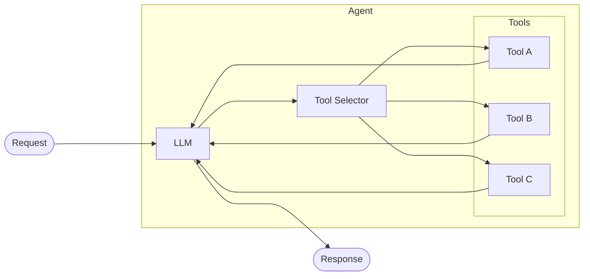

# Agent-Tool Orchestration

## Problem

You need an integration that makes dynamic, multi-step decisions at runtime -- where the sequence and choice of operations cannot be determined at design time. For example, a customer support system must decide whether to look up an order, process a refund, or search a knowledge base based on free-form user input, and may need to chain multiple operations together before producing a final answer.

## Solution

Delegate decision-making to an LLM-backed agent that has access to a set of **tools** (functions). The agent receives a request, reasons about the best course of action, invokes one or more tools, observes the results, and iterates until it can produce a final response. This is sometimes called the ReAct (Reason + Act) pattern.



The agent loop:

1. **Receive** the user message (and conversation history).
2. **Reason** using the LLM about what to do next.
3. **Select** one or more tools and generate the arguments.
4. **Execute** the chosen tools and collect results.
5. **Observe** the results and decide whether more steps are needed.
6. **Respond** with the final answer once the task is complete.

## When to use it

- The set of possible operations is known, but the **order and combination** depend on runtime context.
- The input is unstructured (natural language) and requires interpretation before routing.
- You need multi-step reasoning -- where the output of one tool informs the next tool call.
- Building conversational interfaces (chatbots, copilots) that interact with backend systems.

Avoid this pattern when the workflow is deterministic and fixed -- use a simple service or content-based router instead.

## Implementation

```ballerina
import ballerinax/ai.agent;
import ballerina/http;

configurable string openAiKey = ?;

// Define a tool backed by an HTTP call.
final http:Client inventoryClient = check new ("http://inventory-service:8080");

isolated function checkStock(string sku) returns record {|string sku; int available;}|error {
    return check inventoryClient->get(string `/stock/${sku}`);
}

final agent:Tool stockTool = {
    name: "checkStock",
    description: "Check inventory levels for a product SKU.",
    parameters: {
        properties: {
            "sku": {'type: agent:STRING, description: "Product SKU code"}
        },
        required: ["sku"]
    },
    caller: checkStock
};

// Define a tool backed by a database query.
import ballerinax/postgresql;

final postgresql:Client db = check new ("localhost", "user", "pass", "catalog", 5432);

isolated function lookupProduct(string name) returns record {|string sku; string name; decimal price;}|error {
    return check db->queryRow(
        `SELECT sku, name, price FROM products WHERE name ILIKE ${'%' + name + '%'} LIMIT 1`
    );
}

final agent:Tool productTool = {
    name: "lookupProduct",
    description: "Find a product by name and get its SKU and price.",
    parameters: {
        properties: {
            "name": {'type: agent:STRING, description: "Product name or partial name"}
        },
        required: ["name"]
    },
    caller: lookupProduct
};

// Create the agent.
final agent:Agent shoppingAssistant = check new (
    model: check new agent:OpenAiModel(openAiKey, "gpt-4o"),
    systemPrompt: "You are a shopping assistant. Help customers find products and check availability.",
    tools: [stockTool, productTool]
);

// Expose via HTTP.
service /assistant on new http:Listener(8090) {
    resource function post chat(record {|string message; string sessionId;|} req)
            returns record {|string reply;|}|error {
        string reply = check shoppingAssistant.run(req.message, sessionId = req.sessionId);
        return {reply};
    }
}
```

In this example, if a user asks "Do you have wireless chargers in stock?", the agent will:

1. Call `lookupProduct("wireless charger")` to find the SKU.
2. Call `checkStock("SKU-042")` with the returned SKU.
3. Combine both results into a natural language reply.

## Considerations

- **Cost and latency**: Each agent loop iteration requires an LLM call. Limit the maximum number of iterations to control costs and response times.
- **Tool design**: Keep tool descriptions precise and non-overlapping. Ambiguous descriptions cause the LLM to pick the wrong tool.
- **Error handling**: Tools should return structured error messages that help the LLM decide on a fallback action rather than raw stack traces.
- **Security**: Validate tool arguments before execution. The LLM may hallucinate invalid inputs (e.g., SQL injection in a query parameter).
- **Observability**: Log each step of the agent loop (tool selected, arguments, result) for debugging and auditing.

## Related patterns

- [RAG Pipeline](rag-pipeline.md) -- When the agent needs to retrieve knowledge from a vector store before answering.
- [Scatter-Gather](scatter-gather.md) -- When you need parallel fan-out without LLM reasoning.
- [API Gateway & Orchestration](api-gateway-orchestration.md) -- For deterministic multi-service orchestration without an LLM.
