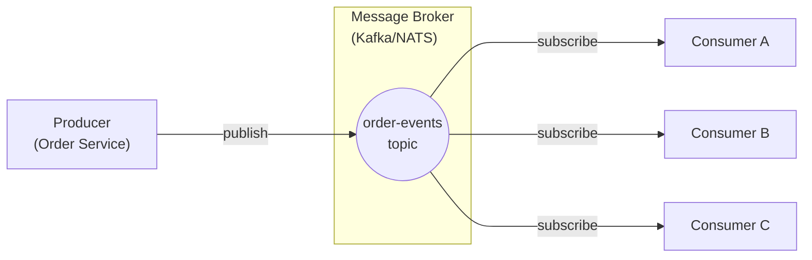

# Publish-Subscribe

## Problem

A producing system needs to notify multiple consuming systems about events, but you do not want the producer to know about or depend on specific consumers. As new consumers are added or removed, the producer should not need to change. Direct point-to-point calls create tight coupling and make it difficult to scale or evolve the system.

## Solution

Introduce a **message broker** (Kafka, NATS, RabbitMQ) between producers and consumers. The producer publishes events to a **topic** (or subject/exchange). Each consumer subscribes to the topics it cares about and processes events independently. The broker handles delivery, buffering, and (depending on the system) persistence.



Each consumer processes the event at its own pace:
- **Consumer A**: Updates inventory counts.
- **Consumer B**: Sends confirmation emails.
- **Consumer C**: Updates the analytics dashboard.

## When to use it

- One event should trigger **multiple independent reactions** across different services.
- Producers and consumers should be **loosely coupled** and evolve independently.
- You need to **buffer events** when consumers are temporarily slow or unavailable.
- Event ordering matters within a partition/subject (use Kafka) or ordering is not critical (NATS, RabbitMQ).

Avoid this pattern when you need a synchronous request-response interaction or when there is only one consumer (a direct call or queue may be simpler).

## Implementation

### Kafka publisher

```ballerina
import ballerinax/kafka;
import ballerina/http;

configurable string kafkaBootstrap = "localhost:9092";

final kafka:Producer eventProducer = check new ({
    bootstrapServers: kafkaBootstrap,
    acks: "all"    // Wait for all replicas to acknowledge
});

type OrderEvent record {|
    string orderId;
    string customerId;
    string eventType;     // "created" | "updated" | "cancelled"
    json payload;
    string timestamp;
|};

service /orders on new http:Listener(8080) {

    resource function post .(OrderEvent order) returns record {|string status;|}|error {
        // Publish the event. The key ensures ordering per customer.
        check eventProducer->send({
            topic: "order-events",
            key: order.customerId.toBytes(),
            value: order.toJsonString().toBytes()
        });
        return {status: "published"};
    }
}
```

### Kafka subscriber (Inventory consumer)

```ballerina
import ballerinax/kafka;
import ballerina/log;

configurable string kafkaBootstrap = "localhost:9092";

listener kafka:Listener inventoryListener = check new ({
    bootstrapServers: kafkaBootstrap,
    groupId: "inventory-service",
    topics: ["order-events"],
    pollingInterval: 1,
    autoCommit: false
});

service on inventoryListener {

    remote function onConsumerRecord(kafka:Caller caller, kafka:ConsumerRecord[] records) returns error? {
        foreach kafka:ConsumerRecord rec in records {
            string payload = check string:fromBytes(rec.value);
            json event = check payload.fromJsonString();
            string eventType = (check event.eventType).toString();

            match eventType {
                "created" => {
                    check reserveInventory(event);
                }
                "cancelled" => {
                    check releaseInventory(event);
                }
                _ => {
                    log:printInfo(string `Ignoring event type: ${eventType}`);
                }
            }
        }
        check caller->commit();
    }
}

function reserveInventory(json event) returns error? {
    log:printInfo(string `Reserving inventory for order ${(check event.orderId).toString()}`);
    // Database update logic here.
}

function releaseInventory(json event) returns error? {
    log:printInfo(string `Releasing inventory for order ${(check event.orderId).toString()}`);
    // Database update logic here.
}
```

### NATS subscriber (Notification consumer)

For lighter-weight pub/sub without persistence requirements, NATS is a good alternative:

```ballerina
import ballerinax/nats;
import ballerina/log;

configurable string natsUrl = "nats://localhost:4222";

listener nats:Listener natsListener = check new (natsUrl);

// Subscribe using a queue group for load balancing across instances.
@nats:ServiceConfig {subject: "order.events", queueGroup: "notification-service"}
service on natsListener {

    remote function onMessage(nats:Message message) returns error? {
        string payload = check string:fromBytes(message.content);
        json event = check payload.fromJsonString();
        string eventType = (check event.eventType).toString();

        if eventType == "created" {
            check sendConfirmationEmail(event);
        }
    }
}

function sendConfirmationEmail(json event) returns error? {
    string customerId = (check event.customerId).toString();
    string orderId = (check event.orderId).toString();
    log:printInfo(string `Sending confirmation email for order ${orderId} to customer ${customerId}`);
    // Email sending logic here.
}
```

## Considerations

- **Delivery guarantees**: Kafka provides at-least-once delivery with manual offset commits. NATS core provides at-most-once. Choose based on your tolerance for duplicates vs. missed messages.
- **Consumer groups**: Use consumer groups (Kafka) or queue groups (NATS) to distribute load across multiple instances of the same consumer.
- **Dead-letter queues**: Implement DLQ handling for messages that repeatedly fail processing to avoid blocking the consumer.
- **Schema evolution**: Use a schema registry (Avro, Protobuf) for event payloads so producers and consumers can evolve independently without breaking each other.
- **Ordering**: Kafka preserves order within a partition. If order matters, use a consistent partition key (e.g., customer ID).
- **Backpressure**: Monitor consumer lag. If consumers fall behind, scale horizontally or increase processing throughput.

## Related patterns

- [Scatter-Gather](scatter-gather.md) -- For parallel fan-out with aggregation, where you wait for all responses.
- [Content-Based Router](content-based-router.md) -- For routing a single event to one specific consumer based on content.
- [Saga / Compensation](saga-compensation.md) -- Events published in a pub/sub system can trigger saga steps in different services.
