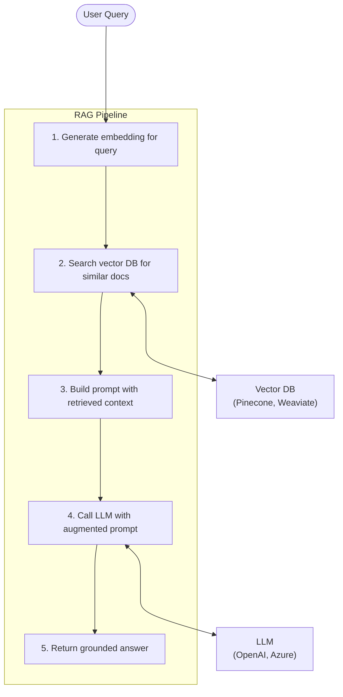

# RAG Pipeline Pattern

## Problem

You need an AI-powered integration that answers questions using your organization's private data -- product documentation, internal policies, customer records -- but the LLM's training data does not include this information. Fine-tuning the model is expensive and does not work well for frequently changing data. Sending the entire knowledge base as context with every request exceeds token limits and is cost-prohibitive.

## Solution

Implement **Retrieval-Augmented Generation (RAG)**: before calling the LLM, retrieve only the most relevant documents from a vector database and inject them into the prompt as context. This gives the LLM access to current, domain-specific knowledge without fine-tuning.



The pipeline has two phases:

**Ingestion** (offline): Documents are split into chunks, embedded, and stored in a vector database.

**Query** (online): The user's question is embedded, similar chunks are retrieved, and they are passed to the LLM as context.

## When to use it

- Your AI agent needs to answer questions about **private or frequently changing data**.
- You want to reduce LLM hallucination by grounding answers in actual source documents.
- Fine-tuning is impractical due to cost, data volume, or how often the data changes.
- You need to provide **citations** (source references) alongside answers.

Avoid this pattern for tasks that do not require domain-specific knowledge (e.g., general conversation, code generation).

## Implementation

### Document ingestion pipeline

```ballerina
import ballerina/http;
import ballerina/io;
import ballerina/log;

configurable string openAiKey = ?;
configurable string vectorDbUrl = ?;
configurable string vectorDbApiKey = ?;

final http:Client embeddingClient = check new ("https://api.openai.com/v1", {
    auth: {token: openAiKey}
});

final http:Client vectorDb = check new (vectorDbUrl, {
    auth: {token: vectorDbApiKey}
});

type DocumentChunk record {|
    string id;
    string text;
    string source;       // File name or URL
    int chunkIndex;
|};

type EmbeddingResponse record {|
    record {|float[] embedding;|}[] data;
|};

// Split a document into overlapping chunks.
function chunkDocument(string content, string source, int chunkSize, int overlap) returns DocumentChunk[] {
    DocumentChunk[] chunks = [];
    int i = 0;
    int idx = 0;
    while i < content.length() {
        int end = int:min(i + chunkSize, content.length());
        chunks.push({
            id: string `${source}-${idx}`,
            text: content.substring(i, end),
            source,
            chunkIndex: idx
        });
        i += chunkSize - overlap;
        idx += 1;
    }
    return chunks;
}

// Generate an embedding vector for a text string.
function generateEmbedding(string text) returns float[]|error {
    EmbeddingResponse response = check embeddingClient->post("/embeddings", {
        model: "text-embedding-3-small",
        input: text
    });
    return response.data[0].embedding;
}

// Ingest a single document: chunk, embed, and store.
function ingestDocument(string filePath) returns error? {
    string content = check io:fileReadString(filePath);
    DocumentChunk[] chunks = chunkDocument(content, filePath, 500, 50);

    foreach DocumentChunk chunk in chunks {
        float[] embedding = check generateEmbedding(chunk.text);
        check vectorDb->post("/vectors/upsert", {
            vectors: [{
                id: chunk.id,
                values: embedding,
                metadata: {text: chunk.text, source: chunk.source, chunkIndex: chunk.chunkIndex}
            }]
        });
    }
    log:printInfo(string `Ingested ${chunks.length()} chunks from ${filePath}`);
}
```

### Query pipeline

```ballerina
// rag_query.bal

type RetrievedChunk record {|
    string text;
    string source;
    float score;
|};

// Retrieve the top-k most relevant chunks for a query.
function retrieveContext(string query, int topK = 5) returns RetrievedChunk[]|error {
    float[] queryEmbedding = check generateEmbedding(query);

    json searchResult = check vectorDb->post("/query", {
        vector: queryEmbedding,
        topK,
        includeMetadata: true
    });

    json[] matches = check (check searchResult.matches).ensureType();
    RetrievedChunk[] chunks = [];
    foreach json m in matches {
        json metadata = check m.metadata;
        chunks.push({
            text: (check metadata.text).toString(),
            source: (check metadata.source).toString(),
            score: check float:fromString((check m.score).toString())
        });
    }
    return chunks;
}

// Build the augmented prompt with retrieved context.
function buildRagPrompt(string question, RetrievedChunk[] context) returns string {
    string contextBlock = "";
    foreach RetrievedChunk chunk in context {
        contextBlock += string `[Source: ${chunk.source}]\n${chunk.text}\n\n`;
    }

    return string `Answer the following question using ONLY the provided context.
If the context does not contain enough information, say "I don't have enough information to answer that."
Always cite your sources.

Context:
${contextBlock}
Question: ${question}

Answer:`;
}

// Full RAG query: retrieve context, then call the LLM.
function ragQuery(string question) returns record {|string answer; string[] sources;|}|error {
    RetrievedChunk[] context = check retrieveContext(question);

    string prompt = buildRagPrompt(question, context);

    json llmResponse = check embeddingClient->post("/chat/completions", {
        model: "gpt-4o",
        messages: [{role: "user", content: prompt}],
        temperature: 0.2
    });

    string answer = (check (check llmResponse.choices)[0].message.content).toString();
    string[] sources = from RetrievedChunk c in context select c.source;
    // Deduplicate sources.
    string[] uniqueSources = [];
    foreach string src in sources {
        if uniqueSources.indexOf(src) is () {
            uniqueSources.push(src);
        }
    }

    return {answer, sources: uniqueSources};
}
```

### HTTP service

```ballerina
// main.bal
import ballerina/http;

service /rag on new http:Listener(8090) {

    resource function post query(record {|string question;|} req)
            returns record {|string answer; string[] sources;|}|error {
        return ragQuery(req.question);
    }

    resource function post ingest(record {|string filePath;|} req) returns record {|string status;|}|error {
        check ingestDocument(req.filePath);
        return {status: "ingested"};
    }
}
```

## Considerations

- **Chunk size**: Smaller chunks (200-500 tokens) give more precise retrieval but may lose context. Larger chunks preserve context but reduce retrieval precision. Experiment with your data.
- **Overlap**: Overlapping chunks (50-100 tokens) prevent important information from being split across chunk boundaries.
- **Top-k selection**: Retrieving too few chunks may miss relevant information. Too many dilutes the context and increases cost. Start with 3-5 and adjust.
- **Embedding model**: Choose an embedding model that performs well on your domain. General-purpose models (OpenAI, Cohere) work well for most text.
- **Hallucination control**: Instruct the LLM to only use the provided context and to say "I don't know" when the context is insufficient.
- **Freshness**: Re-ingest documents when they change. Consider tracking document versions and updating only modified chunks.

## Related patterns

- [Agent-Tool Orchestration](agent-tool-orchestration.md) -- An agent can use RAG retrieval as one of its tools alongside other data sources.
- [Scatter-Gather](scatter-gather.md) -- Search multiple vector databases or knowledge bases in parallel and combine results.
