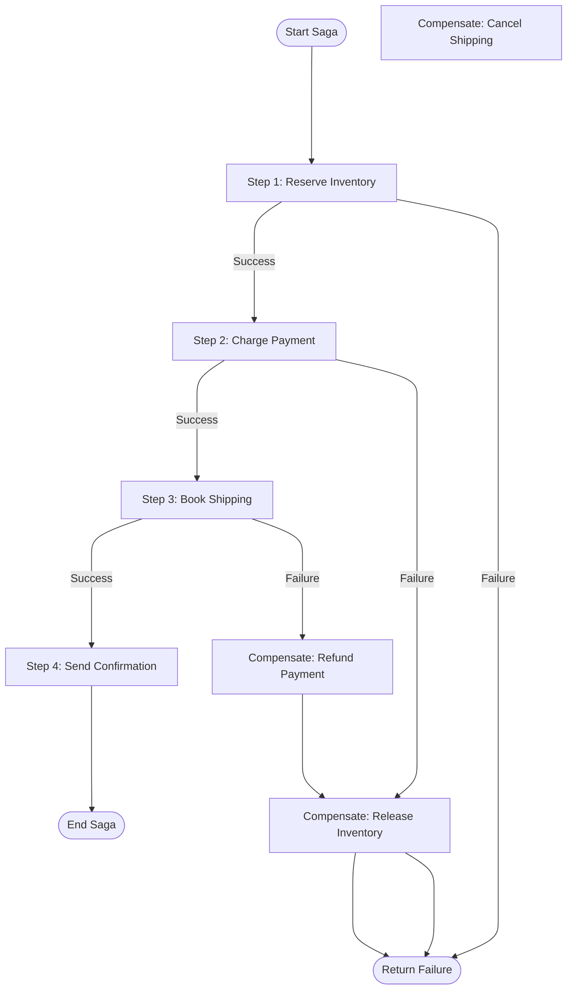

# Saga / Compensation

## Problem

A business transaction spans multiple services (e.g., reserve inventory, charge payment, book shipping), and you need all-or-nothing semantics -- but a traditional distributed transaction (2PC) is impractical because the services are independently deployed, use different databases, or are third-party APIs that do not support distributed transaction protocols.

## Solution

Break the transaction into a sequence of **local transactions**, each handled by one service. Each step has a corresponding **compensating action** that undoes its effect. If any step fails, execute the compensating actions for all previously completed steps in reverse order.

This is the **orchestration-based saga**, where a central coordinator drives the sequence:



## When to use it

- A business operation involves **multiple services** that each manage their own data.
- You need **consistency guarantees** across services without distributed transactions.
- Each step has a clear **undo operation** (compensating action).
- The process is long-running (seconds to hours) and holding locks is not feasible.

Avoid this pattern for operations within a single database (use a local transaction) or when eventual consistency is not acceptable and all services support 2PC.

## Implementation

```ballerina
import ballerina/http;
import ballerina/log;

configurable string inventoryUrl = ?;
configurable string paymentUrl = ?;
configurable string shippingUrl = ?;

final http:Client inventoryClient = check new (inventoryUrl);
final http:Client paymentClient = check new (paymentUrl);
final http:Client shippingClient = check new (shippingUrl);

type OrderRequest record {|
    string orderId;
    string customerId;
    string sku;
    int quantity;
    decimal amount;
    string shippingAddress;
|};

type SagaState record {|
    string orderId;
    string? reservationId;
    string? paymentId;
    string? shipmentId;
    string status;
|};

// Execute the order saga with compensation on failure.
function executeOrderSaga(OrderRequest order) returns SagaState {
    SagaState state = {
        orderId: order.orderId,
        reservationId: (),
        paymentId: (),
        shipmentId: (),
        status: "started"
    };

    // Step 1: Reserve inventory.
    record {|string reservationId;|}|error reservation =
        inventoryClient->post("/reserve", {sku: order.sku, quantity: order.quantity});

    if reservation is error {
        log:printError("Step 1 failed: inventory reservation", reservation);
        state.status = "failed_at_inventory";
        return state;
    }
    state.reservationId = reservation.reservationId;
    log:printInfo(string `Step 1 complete: reserved ${reservation.reservationId}`);

    // Step 2: Charge payment.
    record {|string transactionId;|}|error payment =
        paymentClient->post("/charge", {customerId: order.customerId, amount: order.amount});

    if payment is error {
        log:printError("Step 2 failed: payment charge", payment);
        compensateInventory(state);
        state.status = "failed_at_payment";
        return state;
    }
    state.paymentId = payment.transactionId;
    log:printInfo(string `Step 2 complete: charged ${payment.transactionId}`);

    // Step 3: Book shipping.
    record {|string shipmentId;|}|error shipment =
        shippingClient->post("/book", {
            orderId: order.orderId,
            address: order.shippingAddress,
            sku: order.sku,
            quantity: order.quantity
        });

    if shipment is error {
        log:printError("Step 3 failed: shipping booking", shipment);
        compensatePayment(state);
        compensateInventory(state);
        state.status = "failed_at_shipping";
        return state;
    }
    state.shipmentId = shipment.shipmentId;
    state.status = "completed";
    log:printInfo(string `Saga completed for order ${order.orderId}`);

    return state;
}

// Compensating action: release inventory reservation.
function compensateInventory(SagaState state) {
    if state.reservationId is string {
        http:Response|error result = inventoryClient->delete(
            string `/reserve/${<string>state.reservationId}`
        );
        if result is error {
            log:printError("COMPENSATION FAILED: release inventory", result);
            // In production, write to a compensation failure log for manual resolution.
        } else {
            log:printInfo(string `Compensated: released reservation ${<string>state.reservationId}`);
        }
    }
}

// Compensating action: refund payment.
function compensatePayment(SagaState state) {
    if state.paymentId is string {
        record {}|error result = paymentClient->post("/refund", {
            transactionId: <string>state.paymentId
        });
        if result is error {
            log:printError("COMPENSATION FAILED: refund payment", result);
        } else {
            log:printInfo(string `Compensated: refunded payment ${<string>state.paymentId}`);
        }
    }
}

// Expose the saga via HTTP.
service /orders on new http:Listener(8090) {

    resource function post .(OrderRequest order) returns SagaState|http:InternalServerError {
        SagaState result = executeOrderSaga(order);
        if result.status != "completed" {
            log:printError(string `Order saga failed: ${result.status}`);
        }
        return result;
    }
}
```

## Considerations

- **Compensation failures**: If a compensating action itself fails, you have an inconsistency. Log these failures prominently and implement manual resolution workflows or a retry queue.
- **Idempotency**: Both forward steps and compensating actions must be idempotent. Retrying a compensation should not cause double refunds.
- **Ordering**: Compensating actions must execute in **reverse order** of the forward steps to maintain consistency.
- **Timeouts**: Set timeouts on each step. If a step times out, treat it as a failure and trigger compensation -- but be aware the step may have actually succeeded (need idempotency).
- **Persistence**: For long-running sagas, persist the saga state to a database so it survives process restarts. Resume compensation from the persisted state.
- **Choreography alternative**: Instead of a central orchestrator, each service can publish events that trigger the next step. This reduces coupling but makes the overall flow harder to understand and debug.

## Related patterns

- [API Gateway & Orchestration](api-gateway-orchestration.md) -- Sagas are often coordinated by a gateway or orchestration service.
- [Circuit Breaker & Retry](circuit-breaker.md) -- Apply circuit breakers to individual saga steps to detect persistent failures quickly.
- [Publish-Subscribe](publish-subscribe.md) -- In choreography-based sagas, services communicate via pub/sub events.
