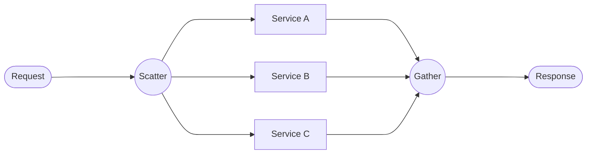

# Scatter-Gather

## Problem

You need to query multiple independent services (or data sources) and combine their responses into a single result. Calling them sequentially is too slow -- the total latency is the sum of all call latencies. You need a way to fan out requests in parallel, wait for all (or most) responses, and aggregate the results.

## Solution

Apply the **Scatter-Gather** pattern: send requests to multiple backends simultaneously, collect all responses, and merge them into a unified result. This is also known as parallel fan-out/fan-in.



The gather phase can use different strategies:
- **Wait for all**: Aggregate only after every response arrives.
- **Wait for quorum**: Proceed after N out of M responses arrive.
- **Best effort with timeout**: Wait up to a deadline and use whatever responses are available.

## When to use it

- You need data from **multiple independent sources** to build a composite response.
- The sources have **no dependencies** on each other (the result of one does not affect the request to another).
- Latency is a concern and sequential calls are too slow.
- Examples: price comparison across vendors, search across multiple indexes, aggregating dashboards from multiple microservices.

Avoid this pattern when calls have sequential dependencies -- use [API Gateway & Orchestration](api-gateway-orchestration.md) instead.

## Implementation

### Using Ballerina workers (Wait for all)

```ballerina
import ballerina/http;
import ballerina/log;
import ballerina/time;

final http:Client supplierA = check new ("http://supplier-a:8080");
final http:Client supplierB = check new ("http://supplier-b:8080");
final http:Client supplierC = check new ("http://supplier-c:8080");

type PriceQuote record {|
    string supplier;
    decimal price;
    string currency;
    int deliveryDays;
|};

type AggregatedQuote record {|
    PriceQuote[] quotes;
    PriceQuote? bestPrice;
    PriceQuote? fastestDelivery;
    int totalTimeMs;
|};

service /api on new http:Listener(8090) {

    resource function get quotes/[string sku]() returns AggregatedQuote|error {
        int startTime = time:monotonicNow();

        // Scatter: fan out to all suppliers in parallel.
        worker wA returns PriceQuote? {
            PriceQuote|error result = supplierA->get(string `/quote/${sku}`);
            if result is error {
                log:printWarn("Supplier A failed", result);
                return ();
            }
            return result;
        }

        worker wB returns PriceQuote? {
            PriceQuote|error result = supplierB->get(string `/quote/${sku}`);
            if result is error {
                log:printWarn("Supplier B failed", result);
                return ();
            }
            return result;
        }

        worker wC returns PriceQuote? {
            PriceQuote|error result = supplierC->get(string `/quote/${sku}`);
            if result is error {
                log:printWarn("Supplier C failed", result);
                return ();
            }
            return result;
        }

        // Gather: wait for all workers.
        PriceQuote? quoteA = wait wA;
        PriceQuote? quoteB = wait wB;
        PriceQuote? quoteC = wait wC;

        // Aggregate results.
        PriceQuote[] quotes = [];
        if quoteA is PriceQuote { quotes.push(quoteA); }
        if quoteB is PriceQuote { quotes.push(quoteB); }
        if quoteC is PriceQuote { quotes.push(quoteC); }

        PriceQuote? bestPrice = ();
        PriceQuote? fastestDelivery = ();
        foreach PriceQuote q in quotes {
            if bestPrice is () || q.price < (<PriceQuote>bestPrice).price {
                bestPrice = q;
            }
            if fastestDelivery is () || q.deliveryDays < (<PriceQuote>fastestDelivery).deliveryDays {
                fastestDelivery = q;
            }
        }

        int endTime = time:monotonicNow();
        return {quotes, bestPrice, fastestDelivery, totalTimeMs: endTime - startTime};
    }
}
```

### Dynamic Scatter-Gather (Variable number of backends)

When the number of backends is not fixed at compile time, use `fork`/`join` or a loop with futures:

```ballerina
import ballerina/http;
import ballerina/log;

type SearchResult record {|
    string 'source;
    json[] results;
|};

type SearchEndpoint record {|
    string name;
    string url;
|};

function scatterSearch(string query, SearchEndpoint[] endpoints) returns SearchResult[] {
    // Launch all searches as futures.
    future<SearchResult?>[] futures = [];
    foreach SearchEndpoint ep in endpoints {
        future<SearchResult?> f = start searchEndpoint(ep, query);
        futures.push(f);
    }

    // Gather all results.
    SearchResult[] allResults = [];
    foreach future<SearchResult?> f in futures {
        SearchResult?|error result = wait f;
        if result is SearchResult {
            allResults.push(result);
        }
    }
    return allResults;
}

function searchEndpoint(SearchEndpoint ep, string query) returns SearchResult? {
    http:Client|error client = new (ep.url);
    if client is error {
        log:printWarn(string `Failed to create client for ${ep.name}`);
        return ();
    }
    json[]|error results = client->get(string `/search?q=${query}`);
    if results is error {
        log:printWarn(string `Search failed for ${ep.name}`, results);
        return ();
    }
    return {'source: ep.name, results};
}
```

## Considerations

- **Timeout strategy**: Set a maximum wait time. If one backend is slow, do not penalize the entire response. Return partial results with metadata indicating which sources responded.
- **Partial failure**: Decide upfront whether missing responses are acceptable. For price comparison, returning 2 of 3 quotes is fine. For consistency checks, you may need all responses.
- **Result deduplication**: When gathering from multiple sources that may overlap, deduplicate results before returning.
- **Load on backends**: Scatter-gather multiplies the load. If you have 10 backends and 100 requests/second, each backend receives 100 requests/second. Combine with circuit breakers.
- **Ordering**: Worker results arrive in completion order, not invocation order. Attach metadata (source name, index) to each result for proper aggregation.

## Related patterns

- [API Gateway & Orchestration](api-gateway-orchestration.md) -- For sequential multi-service calls with dependencies.
- [Publish-Subscribe](publish-subscribe.md) -- For fire-and-forget fan-out without waiting for responses.
- [Circuit Breaker & Retry](circuit-breaker.md) -- Apply to individual scatter branches to handle backend failures.
