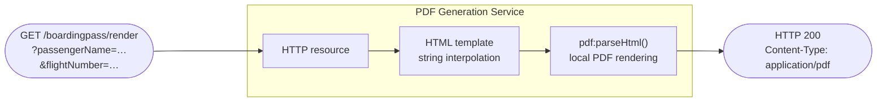

# PDF Generation Service

A service that receives parameters over HTTP, populates an HTML template, and returns the rendered PDF. The example in this tutorial is a boarding pass, but the same pattern fits certificates, invoices, receipts, tickets, shipping labels, and any other parameter-driven document.

## What You'll Build



The service takes passenger details as query parameters, fills them into a boarding-pass HTML template, and returns a ready-to-print PDF. All rendering happens locally through the `ballerina/pdf` module — no external service, no headless browser.

## What You'll Learn

- Using the `ballerina/pdf` module to convert HTML to PDF locally
- Returning a binary (non-JSON) payload from a Ballerina HTTP service
- Embedding images and styled tables in a document template
- Loading custom fonts with `customFonts` to support non-Latin scripts
- Which HTML and CSS features the renderer does and doesn't support

## Prerequisites

- WSO2 Integrator VS Code extension installed
- A font file covering any non-Latin scripts you want to render — [Noto Sans SC from Google Fonts](https://fonts.google.com/noto/specimen/Noto+Sans+SC) is a good default. Only required for the last step of the tutorial.

**Time estimate:** 30 minutes

## Step-by-Step Walkthrough

### Step 1: Create the Project

1. Open VS Code and run **WSO2 Integrator: Open BI Integrator**, then create a new project named `pdf-generation-service`.
2. In `Config.toml`, set the listener port:

   ```toml
   port = 8290
   ```


### Step 2: Set Up the HTTP Service

1. In the project, add an HTTP service. Use a named path like `/boardingpass` rather than the base path.
2. Add a resource `GET /render` that takes five string query parameters: `passengerName`, `flightNumber`, `seat`, `gate`, `boardingTime`.
3. **Change the resource return type from the default `json|error` to `http:Response|error`.** This is the one non-obvious setup step. The PDF is a binary payload, and `http:Response` is the type that lets you set `Content-Type: application/pdf` and a `byte[]` body. Without this change, the service compiles but can't return a PDF.

Your starter service looks like this — we'll fill in the body in later steps:

```ballerina
// service.bal
import ballerina/http;

configurable int port = 8290;

service /boardingpass on new http:Listener(port) {

    resource function get render(
            string passengerName,
            string flightNumber,
            string seat,
            string gate,
            string boardingTime) returns http:Response|error {

        // Body filled in Step 4.
        return error("not implemented");
    }
}
```

### Step 3: Build the HTML Template

The template is a Ballerina string with placeholders for the five parameters. Put it in its own file so the service stays focused on wiring.

```ballerina
// template.bal

// Returns a fully-populated boarding-pass HTML document ready for pdf:parseHtml.
function buildBoardingPassHtml(
        string passengerName,
        string flightNumber,
        string seat,
        string gate,
        string boardingTime) returns string {

    return string `<!DOCTYPE html>
<html>
<head>
  <style>
    body { font-family: 'Liberation Sans', sans-serif; padding: 20px; color: #111; }
    .header { background: #003366; color: #fff; padding: 12px; text-align: center; }
    .header h1 { margin: 0; }
    table { border-collapse: collapse; margin-top: 16px; width: 100%; }
    td { border: 1px solid #000; padding: 8px 14px; }
    .label { background: #eee; font-weight: bold; width: 40%; }
    .banner { background: #003366; color: #fff; text-align: center; font-weight: bold; }
    .footer { margin-top: 24px; font-size: 10px; color: #555; }
  </style>
</head>
<body>
  <div class="header">
    <h1>Boarding Pass</h1>
  </div>
  <table>
    <tr><td class="banner" colspan="2">PASSENGER DETAILS</td></tr>
    <tr><td class="label">Passenger</td><td>${passengerName}</td></tr>
    <tr><td class="label">Flight</td><td>${flightNumber}</td></tr>
    <tr><td class="label">Seat</td><td>${seat}</td></tr>
    <tr><td class="label">Gate</td><td>${gate}</td></tr>
    <tr><td class="label">Boarding</td><td>${boardingTime}</td></tr>
  </table>
  <p class="footer">Please arrive at the gate at least 30 minutes before boarding.</p>
</body>
</html>`;
}
```

A few notes on the CSS used here — these all work cleanly:

- `Liberation Sans` is one of the two fonts bundled with `ballerina/pdf` (the other is Liberation Serif). Between them they cover Latin-1 and Latin Extended-A scripts — enough for most Western European names including accented characters.
- `colspan` on `<td>` and `border-collapse: collapse` render as you'd expect in a browser.
- `solid` borders, cell backgrounds, percentage widths, and cell padding all compose together without special handling.

### Step 4: Generate and Return the PDF

Complete the resource body. The minimum recipe is three calls: render the template, call `pdf:parseHtml`, wrap the result in an `http:Response`.

```ballerina
// service.bal (complete)
import ballerina/http;
import ballerina/pdf;

configurable int port = 8290;

service /boardingpass on new http:Listener(port) {

    resource function get render(
            string passengerName,
            string flightNumber,
            string seat,
            string gate,
            string boardingTime) returns http:Response|error {

        string html = buildBoardingPassHtml(
                passengerName, flightNumber, seat, gate, boardingTime);

        byte[] pdfBytes = check pdf:parseHtml(html);

        http:Response response = new;
        response.setBinaryPayload(pdfBytes);
        response.setContentType("application/pdf");
        return response;
    }
}
```

That's the entire pattern. No listener setup, no chunk handling, no intermediate files — `pdf:parseHtml` takes an HTML string and returns the PDF bytes directly.

### Step 5: Run and Test

1. Run the project (**WSO2 Integrator: Run Project**, or `bal run` from the terminal).
2. Send a request:

   ```bash
   curl "http://localhost:8290/boardingpass/render?\
   passengerName=Alice%20Zhang&\
   flightNumber=WS2026&\
   seat=14A&\
   gate=B7&\
   boardingTime=2026-04-20%2008:45" \
     -o boarding-pass.pdf
   ```

3. Open `boarding-pass.pdf`. You should see a formatted boarding pass with the passenger details laid out in a table.


If a required parameter is missing, `ballerina/http` returns a `400 Bad Request` with a structured JSON body before your resource runs — no need to add your own validation for missing-parameter cases.

### Step 6: Support International Character Sets

Try the same request with a passenger name in Chinese:

```bash
curl "http://localhost:8290/boardingpass/render?\
passengerName=%E5%BC%A0%E4%B8%89&\
flightNumber=WS2026&seat=14A&gate=B7&boardingTime=2026-04-20%2008:45" \
  -o boarding-pass-cjk.pdf
```

The request succeeds and the PDF comes back — but the passenger cell is empty. The Liberation Sans font doesn't contain CJK glyphs, and the renderer drops characters it can't display rather than substituting a placeholder.


The fix is the `customFonts` option on `pdf:parseHtml`. You load a font that covers the scripts you need, pass it in, and reference it by family name in the template's CSS.

Download [Noto Sans SC from Google Fonts](https://fonts.google.com/noto/specimen/Noto+Sans+SC) and place it in a `resources/` directory in your project:

```
pdf-generation-service/
├── Ballerina.toml
├── Config.toml
├── main.bal
├── service.bal
├── template.bal
└── resources/
    └── NotoSansSC.ttf
```

Update the template's CSS to include the custom font at the front of the cascade:

```ballerina
// template.bal — only the <style> body line changes
body { font-family: 'NotoSansCJK', 'Liberation Sans', sans-serif; padding: 20px; color: #111; }
```

Load the font bytes once at module init and pass them to every call:

```ballerina
// service.bal (updated)
import ballerina/http;
import ballerina/io;
import ballerina/pdf;

configurable int port = 8290;

final byte[] & readonly cjkFontBytes = check io:fileReadBytes("./resources/NotoSansSC.ttf");

service /boardingpass on new http:Listener(port) {

    resource function get render(
            string passengerName,
            string flightNumber,
            string seat,
            string gate,
            string boardingTime) returns http:Response|error {

        string html = buildBoardingPassHtml(
                passengerName, flightNumber, seat, gate, boardingTime);

        byte[] pdfBytes = check pdf:parseHtml(html, customFonts = [{
            family: "NotoSansCJK",
            content: cjkFontBytes,
            bold: false,
            italic: false
        }]);

        http:Response response = new;
        response.setBinaryPayload(pdfBytes);
        response.setContentType("application/pdf");
        return response;
    }
}
```

Re-run the project and re-send the CJK request. The characters render correctly.


The font is also subset automatically — only the glyphs actually used appear in the output. A 17 MB source font typically contributes only a few KB to each generated PDF.

The `family` value in the `customFonts` entry must match the name you reference in the CSS. You can load multiple fonts at once (for example, a CJK font and a RTL font) by adding more entries to the array.

## Limitations and Supported Subset

The `ballerina/pdf` renderer covers the HTML and CSS you need for document-style templates but isn't a full browser engine. A few limits worth knowing:

| Not supported | Use instead |
|---|---|
| `display: flex`, CSS Grid, `position: fixed` | Tables or floats for multi-column layouts |
| `@font-face` CSS rules | `customFonts` option on `ConversionOptions` (see Step 6) |
| Inline `<svg>` elements | Rasterise the SVG to PNG at build time (`rsvg-convert`, Inkscape) and embed as a data URL |
| `rowspan`, `<caption>`, `table-layout: fixed` | Plain table rows with `colspan` are supported |
| Non-`solid` border styles (`dashed`, `dotted`, `double`) | Use `solid` and adjust width |
| Glyphs outside loaded fonts' coverage | Load a font that covers them via `customFonts` |

Unsupported features do not raise errors. The renderer silently falls back — flex containers render as block, `@font-face` rules are skipped, SVG elements are dropped. Always preview your generated PDFs visually when you introduce new template features, especially if the template comes from a CSS library or AI-generated HTML.

### `ConversionOptions` Quick Reference

Pass any of these as named arguments to `pdf:parseHtml`:

| Field | Type | Default | Purpose |
|---|---|---|---|
| `pageSize` | `StandardPageSize` or `CustomPageSize` | `A4` | `A4`, `LETTER`, `LEGAL`, or a `{width, height}` record in points. Swap width and height for landscape — there is no separate `orientation` field. |
| `margins` | `PageMargins` | `{top: 0, right: 0, bottom: 0, left: 0}` | Page margins in points |
| `fallbackFontSize` | `float` | `12.0` | Font size used when CSS doesn't specify one |
| `customFonts` | `Font[]` | (none) | Array of `{family, content, bold, italic}` entries for fonts to load |
| `additionalCss` | `string` | (none) | Extra CSS injected into every render |
| `maxPages` | `int` | (none) | Cap on the number of pages rendered — rejects documents larger than this |

## Production Considerations

- **Concurrency is safe.** Each `pdf:parseHtml` call is independent — the library is thread-safe, and concurrent requests don't share mutable state. The renderer is CPU-bound, so throughput scales with cores. Expect hundreds of requests per second per process on modern hardware.
- **Rendering is memory-intensive for large documents.** If you plan to render multi-megabyte templates or long multi-page documents under sustained load, run your own load tests before committing capacity.
- **Validate user input.** This tutorial uses query parameters directly in the HTML template. If any parameter comes from untrusted input, sanitise it first to avoid HTML injection. Escape angle brackets, quotes, and any other HTML-significant characters.

## Summary

You built an HTTP service that turns parameters into a PDF using `ballerina/pdf`. The end-to-end pattern is three calls: render a template string, call `pdf:parseHtml`, wrap the result in an `http:Response` with `application/pdf` content type. You extended it to handle non-Latin scripts via `customFonts` and learned the shape of the renderer's supported subset.

The same pattern — parameterised HTML template plus `pdf:parseHtml` — is the foundation for certificates of completion, invoices, shipping labels, contracts, and any other document a service needs to generate on demand.

## What's Next

- [HTTP Service](../develop/integration-artifacts/service/http-service.md) — the reference for services, resources, and return types
- [REST API Aggregation Service](rest-api-aggregation.md) — another HTTP-service walkthrough, with parallel backend calls
- [Data Mapper](../develop/integration-artifacts/supporting/data-mapper.md) — transform request payloads before rendering, when your input shape doesn't match the template's slots directly
