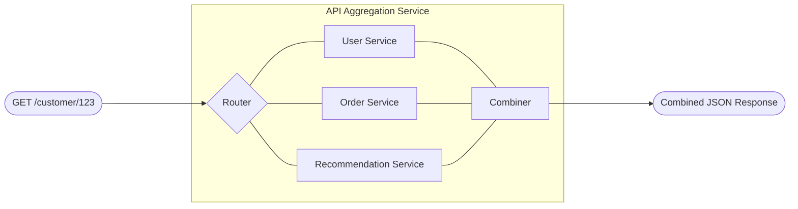

# REST API Aggregation Service

## What you'll build

An API aggregation service that receives a single request, fans out to multiple backend REST APIs in parallel (user profile, order history, recommendations), combines the results into a unified response, and handles partial failures gracefully.



## What you'll learn

- Building an HTTP service that orchestrates multiple backend API calls
- Making parallel HTTP requests using Ballerina workers
- Combining results from multiple sources into a single response
- Handling partial failures with fallback defaults
- Adding response caching and timeouts

## Prerequisites

- WSO2 Integrator VS Code extension installed
- Three backend REST APIs (or mock services for testing)

**Time estimate:** 30--45 minutes

## Step-by-Step walkthrough

### Step 1: Create the project

1. Open VS Code and run **WSO2 Integrator: Create New Project**.
2. Name the project `rest-api-aggregation`.
3. Configure `Config.toml`:

```toml
[aggregation]
port = 8090

[aggregation.backends]
userServiceUrl = "http://localhost:8081"
orderServiceUrl = "http://localhost:8082"
recommendationServiceUrl = "http://localhost:8083"

[aggregation.timeouts]
backendTimeoutSeconds = 5
```

### Step 2: Define the data types

Create `types.bal`:

```ballerina
// types.bal

// User profile from the user service.
type UserProfile record {|
    string userId;
    string name;
    string email;
    string memberSince;
    string tier;
|};

// A single order from the order service.
type OrderSummary record {|
    string orderId;
    string date;
    decimal total;
    string status;
|};

// Product recommendation from the recommendation service.
type Recommendation record {|
    string productId;
    string name;
    decimal price;
    decimal score;
|};

// The unified aggregated response.
type CustomerDashboard record {|
    UserProfile profile;
    OrderSummary[] recentOrders;
    Recommendation[] recommendations;
    AggregationMetadata _metadata;
|};

// Metadata about the aggregation process.
type AggregationMetadata record {|
    int totalTimeMs;
    map<string> sourceStatus;  // e.g. {"userService": "ok", "orderService": "ok"}
|};
```

### Step 3: Build the backend clients

Create `clients.bal` with HTTP clients for each backend:

```ballerina
// clients.bal
import ballerina/http;

configurable string userServiceUrl = ?;
configurable string orderServiceUrl = ?;
configurable string recommendationServiceUrl = ?;
configurable decimal backendTimeoutSeconds = 5;

final http:Client userClient = check new (userServiceUrl, {
    timeout: backendTimeoutSeconds
});

final http:Client orderClient = check new (orderServiceUrl, {
    timeout: backendTimeoutSeconds
});

final http:Client recommendationClient = check new (recommendationServiceUrl, {
    timeout: backendTimeoutSeconds
});

// Fetch user profile. Returns a default on failure.
function fetchUserProfile(string userId) returns UserProfile {
    UserProfile|error result = userClient->get(string `/users/${userId}`);
    if result is error {
        return {userId, name: "Unknown", email: "", memberSince: "", tier: "standard"};
    }
    return result;
}

// Fetch recent orders. Returns an empty array on failure.
function fetchRecentOrders(string userId) returns OrderSummary[] {
    OrderSummary[]|error result = orderClient->get(string `/orders?customerId=${userId}&limit=5`);
    if result is error {
        return [];
    }
    return result;
}

// Fetch recommendations. Returns an empty array on failure.
function fetchRecommendations(string userId) returns Recommendation[] {
    Recommendation[]|error result = recommendationClient->get(string `/recommendations/${userId}`);
    if result is error {
        return [];
    }
    return result;
}
```

### Step 4: Build the aggregation logic

Create `aggregator.bal` that fans out requests in parallel:

```ballerina
// aggregator.bal
import ballerina/time;

// Aggregate data from all backend services for a given customer.
function aggregateCustomerData(string customerId) returns CustomerDashboard|error {
    int startTime = time:monotonicNow();
    map<string> sourceStatus = {};

    // Fan out to all three backends in parallel using workers.
    worker userWorker returns UserProfile {
        return fetchUserProfile(customerId);
    }

    worker orderWorker returns OrderSummary[] {
        return fetchRecentOrders(customerId);
    }

    worker recoWorker returns Recommendation[] {
        return fetchRecommendations(customerId);
    }

    // Wait for all workers to complete.
    UserProfile profile = wait userWorker;
    OrderSummary[] orders = wait orderWorker;
    Recommendation[] recommendations = wait recoWorker;

    // Track which sources succeeded.
    sourceStatus["userService"] = profile.name != "Unknown" ? "ok" : "fallback";
    sourceStatus["orderService"] = orders.length() > 0 ? "ok" : "empty_or_failed";
    sourceStatus["recommendationService"] = recommendations.length() > 0 ? "ok" : "empty_or_failed";

    int endTime = time:monotonicNow();

    return {
        profile,
        recentOrders: orders,
        recommendations,
        _metadata: {
            totalTimeMs: endTime - startTime,
            sourceStatus
        }
    };
}
```

### Step 5: Expose the HTTP service

Create `main.bal`:

```ballerina
// main.bal
import ballerina/http;
import ballerina/log;
import ballerina/cache;

configurable int port = 8090;

// Response cache: 5-minute TTL, max 1000 entries.
final cache:Cache dashboardCache = new ({
    capacity: 1000,
    evictionFactor: 0.2,
    defaultMaxAge: 300
});

service /api on new http:Listener(port) {

    // GET /api/customer/{customerId} — aggregated customer dashboard.
    resource function get customer/[string customerId]() returns CustomerDashboard|http:InternalServerError {
        // Check cache first.
        any|error cached = dashboardCache.get(customerId);
        if cached is CustomerDashboard {
            log:printInfo(string `Cache hit for customer ${customerId}`);
            return cached;
        }

        CustomerDashboard|error dashboard = aggregateCustomerData(customerId);
        if dashboard is error {
            log:printError("Aggregation failed", dashboard);
            return http:INTERNAL_SERVER_ERROR;
        }

        // Store in cache.
        error? cacheResult = dashboardCache.put(customerId, dashboard);
        if cacheResult is error {
            log:printWarn("Failed to cache response", cacheResult);
        }

        return dashboard;
    }

    // DELETE /api/customer/{customerId}/cache — invalidate cache for a customer.
    resource function delete customer/[string customerId]/cache() returns http:NoContent {
        error? result = dashboardCache.invalidate(customerId);
        return http:NO_CONTENT;
    }

    // GET /api/health — health check.
    resource function get health() returns record {|string status;|} {
        return {status: "UP"};
    }
}
```

### Step 6: Add error handling and timeouts

The client-level timeouts were set in Step 3. Add a service-level timeout with a wrapper in `error_handler.bal`:

```ballerina
// error_handler.bal
import ballerina/log;

// Log aggregation errors with context.
function logAggregationError(string customerId, string source, error err) {
    log:printError(
        string `Aggregation error for customer ${customerId} from ${source}`,
        err
    );
}
```

### Step 7: Test it

1. Start mock backend services (or use a tool like WireMock):

```bash
# Start a simple mock user service on port 8081
# Start a simple mock order service on port 8082
# Start a simple mock recommendation service on port 8083
```

2. Start the aggregation service:

```bash
bal run
```

3. Test the aggregated endpoint:

```bash
curl http://localhost:8090/api/customer/CUST-100 | jq
```

4. Expected response:

```json
{
  "profile": {
    "userId": "CUST-100",
    "name": "Alice Johnson",
    "email": "alice@example.com",
    "memberSince": "2022-01-15",
    "tier": "premium"
  },
  "recentOrders": [
    {"orderId": "ORD-501", "date": "2024-02-28", "total": 149.99, "status": "delivered"},
    {"orderId": "ORD-498", "date": "2024-02-20", "total": 35.00, "status": "delivered"}
  ],
  "recommendations": [
    {"productId": "PROD-42", "name": "Wireless Charger", "price": 29.99, "score": 0.95}
  ],
  "_metadata": {
    "totalTimeMs": 120,
    "sourceStatus": {"userService": "ok", "orderService": "ok", "recommendationService": "ok"}
  }
}
```

5. Test partial failure (stop the recommendation service):

```bash
curl http://localhost:8090/api/customer/CUST-100 | jq '._metadata'
```

The response will still return with `"recommendationService": "empty_or_failed"` and an empty recommendations array.

6. Run automated tests:

```bash
bal test
```

## Extend it

- **Add GraphQL support** to let clients query only the fields they need.
- **Implement circuit breakers** on each backend client to avoid cascading failures.
- **Add request correlation IDs** for distributed tracing across backend calls.
- **Rate-limit the endpoint** to prevent abuse and protect backend services.
- **Support batch customer lookups** with a POST endpoint that aggregates for multiple IDs.

## Full source code

Find the complete working project on GitHub:
[wso2/integrator-samples/rest-api-aggregation](https://github.com/wso2/integrator-samples/tree/main/rest-api-aggregation)
