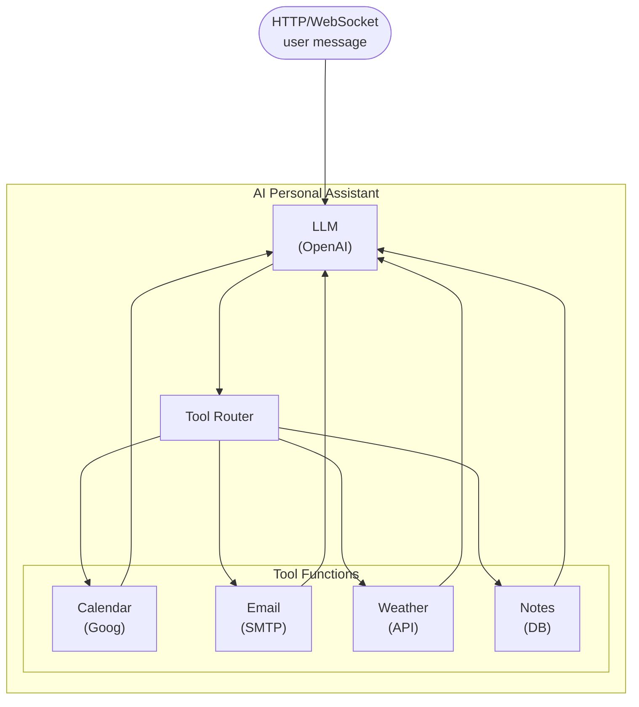

# AI Personal Assistant

## Overview

A conversational AI assistant that manages your calendar, sends emails, checks the weather, and searches your notes -- all through natural language. The assistant uses an LLM for reasoning and Ballerina tool functions to interact with external services. It exposes both an HTTP API and a WebSocket endpoint for real-time chat.

## Architecture diagram



## Features demonstrated

- **LLM-powered agent** with multi-tool orchestration
- **Google Calendar integration** -- create, list, and update events
- **Email sending** via SMTP with natural language composition
- **Weather lookups** via a public REST API
- **Notes search** backed by a PostgreSQL database with full-text search
- **Conversation memory** -- the assistant remembers context within a session
- **WebSocket endpoint** for real-time bidirectional chat

## Prerequisites

- WSO2 Integrator VS Code extension installed
- OpenAI API key
- Google Calendar API credentials (OAuth2 client ID and secret)
- PostgreSQL database for the notes store
- SMTP credentials for sending email

## Quick start

```bash
git clone https://github.com/wso2/integrator-samples.git
cd integrator-samples/ai-personal-assistant
cp Config-example.toml Config.toml
# Edit Config.toml with your API keys and credentials
bal run
```

The service starts on port 8090 with two endpoints:
- `POST /assistant/chat` -- HTTP request-response
- `ws://localhost:8090/assistant/ws` -- WebSocket for real-time chat

## Code walkthrough

### Project structure

```
ai-personal-assistant/
├── Ballerina.toml
├── Config.toml
├── Config-example.toml
├── main.bal              # HTTP + WebSocket service
├── agent.bal             # Agent definition and system prompt
├── tools/
│   ├── calendar.bal      # Google Calendar tool functions
│   ├── email.bal         # Email sending tool
│   ├── weather.bal       # Weather lookup tool
│   └── notes.bal         # Notes search tool
├── types.bal             # Shared record types
└── tests/
    └── agent_test.bal    # Integration tests with mocked tools
```

### Agent definition (`agent.bal`)

The agent is configured with a system prompt that describes its capabilities and four tool bindings:

```ballerina
import ballerinax/ai.agent;

configurable string openAiKey = ?;

final agent:Agent assistant = check new (
    model: check new agent:OpenAiModel(openAiKey, "gpt-4o"),
    systemPrompt: string `You are a helpful personal assistant. You can:
- Manage calendar events (create, list, update)
- Send emails on behalf of the user
- Check the weather for any city
- Search through the user's personal notes
Be concise and confirm before taking actions like sending emails or creating events.`,
    tools: [calendarListTool, calendarCreateTool, emailSendTool, weatherTool, notesSearchTool]
);
```

### Calendar tool (`tools/calendar.bal`)

```ballerina
isolated function listCalendarEvents(string date) returns json|error {
    // Calls Google Calendar API to list events for the given date.
    return check googleCalendarClient->get(string `/events?timeMin=${date}T00:00:00Z&timeMax=${date}T23:59:59Z`);
}

isolated function createCalendarEvent(string title, string date, string startTime, string endTime)
        returns record {|string eventId; string status;|}|error {
    return check googleCalendarClient->post("/events", {
        summary: title,
        'start: {dateTime: string `${date}T${startTime}:00`},
        end: {dateTime: string `${date}T${endTime}:00`}
    });
}
```

### Email tool (`tools/email.bal`)

```ballerina
isolated function sendEmail(string to, string subject, string body) returns record {|boolean sent;|}|error {
    check smtpClient->send({to, subject, body});
    return {sent: true};
}
```

### Testing

The test suite mocks external services so tests run without real API keys:

```bash
bal test
```

Example test interaction:

```
User: "What's on my calendar for tomorrow?"
Agent: [calls listCalendarEvents("2024-03-02")]
Agent: "You have 2 events tomorrow: Team standup at 9:00 AM and a dentist appointment at 2:00 PM."
```

## GitHub

[wso2/integrator-samples/ai-personal-assistant](https://github.com/wso2/integrator-samples/tree/main/ai-personal-assistant)
