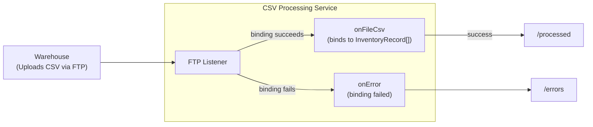

# Process CSV files from FTP with typed record binding

Build an FTP file processing service that watches a directory for inventory CSV files, binds rows directly to typed records, and automatically routes files to separate directories based on whether the file parsed cleanly.

## What you'll build

An FTP listener that monitors `/incoming` for CSV files uploaded by warehouse systems. Each file contains inventory records with fields like SKU, quantity, and unit price. The service binds every row to a typed `InventoryRecord`. Files that parse cleanly are logged and moved to `/processed`. Files with any row that fails to bind to the record type fall through to an `onError` handler, which moves them to `/errors` for later inspection.

## What you'll learn

- Configuring an FTP listener to watch for CSV files with a file name pattern
- Using `onFileCsv` with a typed record array parameter so the runtime performs CSV-to-record binding for you
- Using `@ftp:FunctionConfig` with `afterProcess` and `afterError` to auto-move files
- Providing an `onError` handler to route files that fail to bind
- Handling processing errors with `do/on fail`

## Prerequisites

- WSO2 Integrator VS Code extension installed
- Basic familiarity with Ballerina syntax
- Docker installed (for the FTP server)

**Time estimate:** 30--45 minutes

## Architecture



## Step 1: Create the Ballerina project

Create a new Ballerina project:

```bash
bal new csv_ftp_processor
cd csv_ftp_processor
```

This creates a project directory with a `Ballerina.toml` and a default `main.bal`. You will replace the generated files with the ones below.

## Step 2: Define the data types

Create `types.bal` in the project root with the record type for inventory data:

```ballerina
// types.bal

type InventoryRecord record {|
    string warehouseId;
    string sku;
    string productName;
    int quantity;
    decimal unitPrice;
    string lastUpdated;
|};
```

The closed record (`record {|...|}`) ensures that only these six fields are accepted. The `quantity` (int) and `unitPrice` (decimal) fields are typed so that rows with non-numeric values fail binding and route the file to the error path.

## Step 3: Add configurable values

Create `config.bal` in the project root to declare the FTP connection and path values so they can be set per environment:

```ballerina
// config.bal

configurable string ftpHost = "127.0.0.1";
configurable int ftpPort = 2123;
configurable string ftpUser = "admin";
configurable string ftpPassword = "admin";

configurable string incomingPath = "/incoming";
configurable string processedPath = "/processed";
configurable string errorsPath = "/errors";
```

## Step 4: Build the FTP listener and service

Replace the contents of `main.bal` with the listener and service:

```ballerina
// main.bal
import ballerina/ftp;
import ballerina/log;

listener ftp:Listener ftpListener = new (
    protocol = ftp:FTP,
    host = ftpHost,
    auth = {credentials: {username: ftpUser, password: ftpPassword}},
    port = ftpPort
);

@ftp:ServiceConfig {
    path: incomingPath,
    fileNamePattern: ".*\\.csv"
}
service on ftpListener {

    @ftp:FunctionConfig {
        afterProcess: {moveTo: processedPath},
        afterError: {moveTo: errorsPath}
    }
    remote function onFileCsv(InventoryRecord[] inventoryRecords, ftp:FileInfo fileInfo) returns error? {
        do {
            log:printInfo(string `Processing file: ${fileInfo.name} (${fileInfo.size} bytes)`);
            if inventoryRecords.length() == 0 {
                return error("No valid records found in " + fileInfo.name);
            }
            foreach InventoryRecord item in inventoryRecords {
                log:printInfo(string `Warehouse: ${item.warehouseId}, SKU: ${item.sku}, ` +
                        string `Product: ${item.productName}, Qty: ${item.quantity}, ` +
                        string `Price: ${item.unitPrice}, Updated: ${item.lastUpdated}`);
            }

            log:printInfo(string `Successfully processed ${fileInfo.name}`);
        } on fail error err {
            log:printError(string `Failed to process ${fileInfo.name}`, 'error = err);
            return err;
        }
    }

    @ftp:FunctionConfig {
        afterProcess: {moveTo: errorsPath},
        afterError: {moveTo: errorsPath}
    }
    remote function onError(ftp:Error ftpError) returns error? {
        do {
            log:printError("Failed to parse file content to the target schema: " + ftpError.message());
        } on fail error err {
            log:printError("Failed to handle the error", 'error = err);
            return err;
        }
    }
}
```

Key points in this code:

- **`onFileCsv(InventoryRecord[] inventoryRecords, ...)`** — the typed array parameter tells the FTP connector to bind each CSV row to an `InventoryRecord`. The first row of the CSV is used as the header, so column names must match the record fields. No `csv` module import is needed.
- **Whole-file binding** — if any row fails to convert (for example, a non-numeric `quantity`), the entire binding fails and `onFileCsv` is *not* invoked. The file falls through to the `onError` handler instead. This is the main trade-off against per-row fail-safe parsing: you get simpler code at the cost of losing valid rows that happened to share a file with a bad row.
- **`afterProcess` / `afterError`** — the FTP connector automatically moves the file to the `moveTo` path after the handler completes. `afterProcess` triggers on success (moving to `/processed`), and `afterError` triggers when the handler returns an error (moving to `/errors`).
- **`onError` handler** — called when binding fails before `onFileCsv` can run. Both `afterProcess` and `afterError` point at `errorsPath`, so the file ends up in `/errors` regardless of whether the handler itself throws.
- **Zero-records check** — an empty but structurally valid file would otherwise succeed with no work done. Returning an error triggers `afterError` instead so the file is not silently moved to `/processed`.
- **`do/on fail`** — catches any unrecoverable error during processing and re-returns it so the `afterError` action triggers.

## Step 5: Add the configuration file

Create `Config.toml` in the project root with default values for the local Docker FTP server:

```toml
# Config.toml

ftpHost = "127.0.0.1"
ftpPort = 2123
ftpUser = "admin"
ftpPassword = "admin"

incomingPath = "/incoming"
processedPath = "/processed"
errorsPath = "/errors"
```

## Step 6: Prepare sample data

Create a `sample-data/` directory in the project root:

```bash
mkdir sample-data
```

Create `sample-data/warehouse-daily.csv` with five well-formed inventory rows. This file exercises the happy path — all rows bind cleanly, `onFileCsv` runs, and the file moves to `/processed`:

```csv
warehouseId,sku,productName,quantity,unitPrice,lastUpdated
WH-01,SKU-1001,Wireless Mouse,150,24.99,2026-04-06
WH-01,SKU-1002,USB-C Hub,75,49.50,2026-04-06
WH-02,SKU-2001,Monitor Stand,20,34.99,2026-04-06
WH-02,SKU-2002,Desk Lamp,200,19.99,2026-04-06
WH-03,SKU-3001,Keyboard,120,89.00,2026-04-06
```

Create `sample-data/bad-inventory.csv` with data rows containing invalid values in the typed columns. `INVALID` is not an `int` and `NaN` is not a `decimal`, so binding fails at the first bad row. This exercises the error path — `onError` runs and the file moves to `/errors`:

```csv
warehouseId,sku,productName,quantity,unitPrice,lastUpdated
WH-99,BAD-001,Broken Item,INVALID,INVALID,2026-04-06
WH-99,BAD-002,Another Bad,NaN,NaN,2026-04-06
```

## Step 7: Start the FTP server

Create a `docker-compose.yml` in the project root:

```yaml
services:
  ftp:
    image: delfer/alpine-ftp-server
    environment:
      - USERS=admin|admin|/ftp/admin
      - ADDRESS=127.0.0.1
      - MIN_PORT=30000
      - MAX_PORT=30009
    ports:
      - "2123:21"
      - "30000-30009:30000-30009"
    entrypoint:
      - /bin/sh
      - -c
      - |
        mkdir -p /ftp/admin/incoming /ftp/admin/processed /ftp/admin/errors
        printf '\nchroot_local_user=YES\nallow_writeable_chroot=YES\n' >> /etc/vsftpd/vsftpd.conf
        (sleep 3 && chown -R admin:admin /ftp/admin) &
        exec /sbin/tini -- /bin/start_vsftpd.sh
```

Start the FTP server:

```bash
docker-compose up -d
```

## Step 8: Run and test

Start the Ballerina service:

```bash
bal run
```

In a separate terminal, upload the sample CSV file to the FTP server:

```bash
curl -T sample-data/warehouse-daily.csv ftp://127.0.0.1:2123/incoming/warehouse-daily.csv --user "admin:admin"
```

The listener detects the new CSV file on the next polling cycle and processes it. Expected output:

```bash
time=... level=INFO module=.../csv_ftp_processor message="Processing file: warehouse-daily.csv (294 bytes)"
time=... level=INFO module=.../csv_ftp_processor message="Warehouse: WH-01, SKU: SKU-1001, Product: Wireless Mouse, Qty: 150, Price: 24.99, Updated: 2026-04-06"
time=... level=INFO module=.../csv_ftp_processor message="Warehouse: WH-01, SKU: SKU-1002, Product: USB-C Hub, Qty: 75, Price: 49.5, Updated: 2026-04-06"
time=... level=INFO module=.../csv_ftp_processor message="Warehouse: WH-02, SKU: SKU-2001, Product: Monitor Stand, Qty: 20, Price: 34.99, Updated: 2026-04-06"
time=... level=INFO module=.../csv_ftp_processor message="Warehouse: WH-02, SKU: SKU-2002, Product: Desk Lamp, Qty: 200, Price: 19.99, Updated: 2026-04-06"
time=... level=INFO module=.../csv_ftp_processor message="Warehouse: WH-03, SKU: SKU-3001, Product: Keyboard, Qty: 120, Price: 89.0, Updated: 2026-04-06"
time=... level=INFO module=.../csv_ftp_processor message="Successfully processed warehouse-daily.csv"
```

All five rows bind successfully, so the file moves to `/processed`.

After processing completes, verify the file moved to `/processed`:

```bash
# File should now be in /processed
curl ftp://127.0.0.1:2123/processed/ --user "admin:admin"

# /incoming should be empty
curl ftp://127.0.0.1:2123/incoming/ --user "admin:admin"
```

### Testing the error path

Upload the `bad-inventory.csv` file where every data row has invalid values in the `quantity` and `unitPrice` columns:

```bash
curl -T sample-data/bad-inventory.csv ftp://127.0.0.1:2123/incoming/bad-inventory.csv --user "admin:admin"
```

Binding to `InventoryRecord[]` fails at the first bad row, so `onFileCsv` is never invoked. The FTP connector calls `onError` instead, which logs the failure and lets `afterProcess` move the file to `/errors`. Expected output:

```text
time=... level=ERROR module=.../csv_ftp_processor message="Failed to parse file content to the target schema: <binding error detail>"
```

Verify the file moved to `/errors` on the FTP server:

```bash
# File should now be in /errors
curl ftp://127.0.0.1:2123/errors/ --user "admin:admin"

# /incoming should be empty
curl ftp://127.0.0.1:2123/incoming/ --user "admin:admin"
```

## Extend it

- **Tolerate malformed rows** — Replace the typed `InventoryRecord[]` parameter with `string[][] content` and use `csv:parseList` with its `failSafe` option to skip bad rows individually instead of rejecting the whole file
- **Stream large files** — Use `stream<string[], error?> content` in the `onFileCsv` signature to process rows incrementally without loading the entire file into memory
- **Write valid records to a database** — Add a MySQL or PostgreSQL connector and insert each `InventoryRecord` into a database table inside the foreach loop
- **Send alerts on failure** — Add an email or Slack notification when files land in `/errors` so operations teams can investigate promptly
- **Add file dependency** — Require a `.done` marker file before processing, similar to the [FTP order batch walkthrough](process-ftp-order-batches-age-filter-and-file-dependency.md)

## What's next

- [CSV flat file processing](../../develop/transform/csv-flat-file-processing.md) -- CSV parsing patterns including projections, custom delimiters, and fail-safe options
- [FTP / SFTP services](../../develop/integration-artifacts/file/ftp-sftp.md) -- FTP service configuration, authentication, and post-processing reference
- [Process FTP order batches](process-ftp-order-batches-age-filter-and-file-dependency.md) -- Age filtering and file dependency patterns for FTP listeners
- [EDI FTP processing](process-edi-documents-from-ftp.md) -- End-to-end EDI file processing over SFTP
