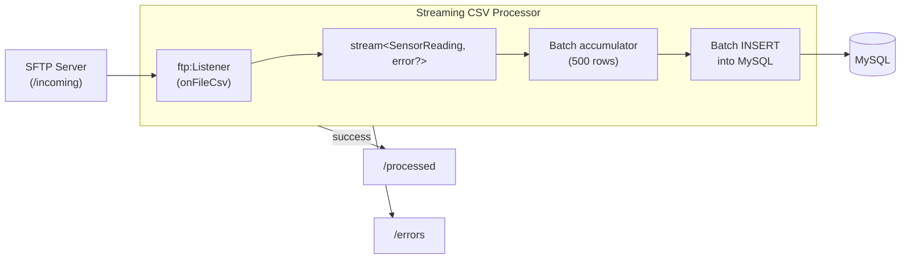

# Stream Large CSV Files from SFTP

Build an SFTP file processing service that streams large CSV files row-by-row, validates and inserts each record into a database, and handles errors without loading the entire file into memory.

## What you'll build

An SFTP listener that monitors `/incoming` for large CSV files (hundreds of thousands of rows). Instead of loading the entire file into memory, the handler receives a `stream<Record, error?>` that delivers one typed record at a time. Each record is validated and batch-inserted into a MySQL database. After processing, the file moves to `/processed` or `/errors` based on the outcome.

## What you'll learn

- Using `stream<RecordType, error?>` as the first parameter in `onFileCsv` to process files incrementally
- Handling stream errors (malformed rows that terminate the stream)
- Accumulating records into batches for efficient database inserts
- Using `@ftp:FunctionConfig` `afterProcess` / `afterError` with streamed handlers
- Configuring SFTP with private key authentication

## Prerequisites

- WSO2 Integrator VS Code extension installed
- Basic familiarity with Ballerina syntax
- Docker installed (for the SFTP server and MySQL)

**Time estimate:** 30–45 minutes

## Architecture



## Step 1: Create the Ballerina project

```bash
bal new streaming_csv_processor
cd streaming_csv_processor
```

## Step 2: Define the data types

Create `types.bal`:

```ballerina
// types.bal

// Matches the CSV column headers exactly.
type SensorReading record {|
    string sensorId;
    string timestamp;
    decimal temperature;
    decimal humidity;
    string location;
|};
```

## Step 3: Add configurable values

Create `config.bal`:

```ballerina
// config.bal

// SFTP connection
configurable string sftpHost = "127.0.0.1";
configurable int sftpPort = 22;
configurable string sftpUser = "sftpuser";
configurable string sftpPassword = "sftppass";

// Paths
configurable string incomingPath = "/incoming";
configurable string processedPath = "/processed";
configurable string errorsPath = "/errors";

// Database
configurable string dbHost = "127.0.0.1";
configurable int dbPort = 3306;
configurable string dbUser = "root";
configurable string dbPassword = "root";
configurable string dbName = "sensors";

// Processing
configurable int batchSize = 500;
```

## Step 4: Build the database loader

Create `loader.bal`:

```ballerina
// loader.bal
import ballerinax/mysql;
import ballerina/sql;
import ballerina/log;

final mysql:Client dbClient = check new (dbHost, dbUser, dbPassword, dbName, dbPort);

function insertBatch(SensorReading[] batch) returns error? {
    if batch.length() == 0 {
        return;
    }

    sql:ParameterizedQuery[] queries = from SensorReading r in batch
        select `INSERT INTO sensor_readings (sensor_id, reading_time, temperature, humidity, location)
                VALUES (${r.sensorId}, ${r.timestamp}, ${r.temperature}, ${r.humidity}, ${r.location})`;

    _ = check dbClient->batchExecute(queries);
    log:printInfo(string `Inserted batch: ${batch.length()} rows`);
}
```

## Step 5: Wire up the streaming file processor

Replace the contents of `main.bal`:

```ballerina
// main.bal
import ballerina/ftp;
import ballerina/log;

listener ftp:Listener sftpListener = new (
    protocol = ftp:SFTP,
    host = sftpHost,
    port = sftpPort,
    auth = {credentials: {username: sftpUser, password: sftpPassword}},
    pollingInterval = 15
);

@ftp:ServiceConfig {
    path: incomingPath,
    fileNamePattern: ".*\\.csv"
}
service on sftpListener {

    @ftp:FunctionConfig {
        afterProcess: {moveTo: processedPath},
        afterError: {moveTo: errorsPath}
    }
    remote function onFileCsv(stream<SensorReading, error?> content,
                              ftp:FileInfo fileInfo) returns error? {
        log:printInfo(string `Streaming file: ${fileInfo.name} (${fileInfo.size} bytes)`);

        int totalRows = 0;
        SensorReading[] batch = [];

        do {
            check content.forEach(function(SensorReading reading) {
                batch.push(reading);
                totalRows += 1;

                // Flush batch when it reaches the configured size
                if batch.length() >= batchSize {
                    error? err = insertBatch(batch);
                    if err is error {
                        log:printError("Batch insert failed", 'error = err);
                    }
                    batch = [];
                }
            });

            // Flush remaining rows
            check insertBatch(batch);

            log:printInfo(string `Completed: ${fileInfo.name}, ${totalRows} rows processed`);
        } on fail error err {
            log:printError(string `Stream error in ${fileInfo.name} at row ~${totalRows}`,
                           'error = err);
            // Insert whatever we have so far
            error? flushErr = insertBatch(batch);
            if flushErr is error {
                log:printError("Failed to flush partial batch", 'error = flushErr);
            }
            return err; // triggers afterError → move to /errors
        }
    }
}
```

Key points:

- **`stream<SensorReading, error?>`** — The first parameter receives a typed stream. Each CSV row is automatically parsed and bound to `SensorReading` as the stream is consumed. The file is never fully loaded into memory.
- **Batch accumulation** — Rows are collected into a batch array and flushed to MySQL every `batchSize` rows. This balances memory use against database round-trips.
- **Stream error handling** — If a row cannot be bound to `SensorReading` (wrong column count, type mismatch), the stream terminates with an error. The `on fail` block flushes whatever rows were successfully processed, then returns the error so `afterError` moves the file to `/errors`.
- **`afterProcess` / `afterError`** — Triggered based on the handler's return value: `nil` (success) or `error`. The stream is fully closed before the post-processing action runs.

## Step 6: Add the configuration file

Create `Config.toml`:

```toml
# Config.toml

sftpHost = "127.0.0.1"
sftpPort = 2222
sftpUser = "sftpuser"
sftpPassword = "sftppass"

incomingPath = "/incoming"
processedPath = "/processed"
errorsPath = "/errors"

dbHost = "127.0.0.1"
dbPort = 3306
dbUser = "root"
dbPassword = "root"
dbName = "sensors"

batchSize = 500
```

## Step 7: Set up the infrastructure

Create `docker-compose.yml`:

```yaml
services:
  sftp:
    image: atmoz/sftp
    command: sftpuser:sftppass:::incoming,processed,errors
    ports:
      - "2222:22"

  mysql:
    image: mysql:8
    environment:
      MYSQL_ROOT_PASSWORD: root
      MYSQL_DATABASE: sensors
    ports:
      - "3306:3306"
    volumes:
      - ./init.sql:/docker-entrypoint-initdb.d/init.sql
```

Create `init.sql` for the database schema:

```sql
CREATE TABLE IF NOT EXISTS sensor_readings (
    id BIGINT AUTO_INCREMENT PRIMARY KEY,
    sensor_id VARCHAR(50) NOT NULL,
    reading_time VARCHAR(30) NOT NULL,
    temperature DECIMAL(6,2) NOT NULL,
    humidity DECIMAL(6,2) NOT NULL,
    location VARCHAR(100) NOT NULL,
    created_at TIMESTAMP DEFAULT CURRENT_TIMESTAMP
);
```

Start the infrastructure:

```bash
docker-compose up -d
```

## Step 8: Generate sample data

Create `generate-sample.sh` to produce a large CSV file:

```bash
#!/bin/bash
FILE="sample-data/sensor-readings.csv"
mkdir -p sample-data
echo "sensorId,timestamp,temperature,humidity,location" > "$FILE"

for i in $(seq 1 10000); do
    SENSOR="SENSOR-$(printf '%03d' $((RANDOM % 50 + 1)))"
    TEMP="$(echo "scale=1; 15 + $RANDOM % 200 / 10" | bc)"
    HUMID="$(echo "scale=1; 30 + $RANDOM % 500 / 10" | bc)"
    echo "${SENSOR},2026-04-15T$(printf '%02d:%02d:%02d' $((RANDOM%24)) $((RANDOM%60)) $((RANDOM%60))),${TEMP},${HUMID},Floor-$((RANDOM % 5 + 1))" >> "$FILE"
done

echo "Generated $(wc -l < "$FILE") rows in $FILE"
```

```bash
chmod +x generate-sample.sh
./generate-sample.sh
```

This generates a 10,000-row CSV file.

## Step 9: Run and test

Start the Ballerina service:

```bash
bal run
```

Upload the sample file to the SFTP server:

```bash
scp -P 2222 sample-data/sensor-readings.csv sftpuser@127.0.0.1:/incoming/
```

The listener detects the file on the next polling cycle and streams it row-by-row. Expected output:

```text
time=... level=INFO message="Streaming file: sensor-readings.csv (580234 bytes)"
time=... level=INFO message="Inserted batch: 500 rows"
time=... level=INFO message="Inserted batch: 500 rows"
...
time=... level=INFO message="Inserted batch: 500 rows"
time=... level=INFO message="Completed: sensor-readings.csv, 10000 rows processed"
```

Verify:

```bash
# File moved to /processed
sftp -P 2222 sftpuser@127.0.0.1 <<< "ls /processed"

# Records in database
mysql -h 127.0.0.1 -u root -proot sensors -e "SELECT COUNT(*) FROM sensor_readings;"
```

## Extend it

- **Scale up** — Generate 1M+ rows to verify memory stays constant regardless of file size
- **Add fail-safe CSV** — Enable fault tolerance so corrupted rows are skipped instead of terminating the stream
- **Parallel batches** — Use Ballerina workers to insert batches concurrently while the stream continues
- **Add file dependency** — Wait for a `.done` marker file before processing, using [file dependency conditions](../../develop/integration-artifacts/file/dependency-and-trigger-conditions.md)
- **Add coordination** — Deploy multiple instances with [high availability](../../develop/integration-artifacts/file/high-availability-and-coordination.md) to prevent duplicate processing

## What's next

- [Streaming large files](../../develop/integration-artifacts/file/streaming-large-files.md) — reference for stream handler signatures and error behaviour
- [CSV fault tolerance](../../develop/integration-artifacts/file/csv-fault-tolerance.md) — skip malformed rows without halting the stream
- [FTP / SFTP](../../develop/integration-artifacts/file/ftp-sftp.md) — service configuration, authentication, and file handlers
- [CSV FTP processing tutorial](process-csv-files-from-ftp-fail-safe-error-handling.md) — fail-safe CSV parsing with automatic file routing
